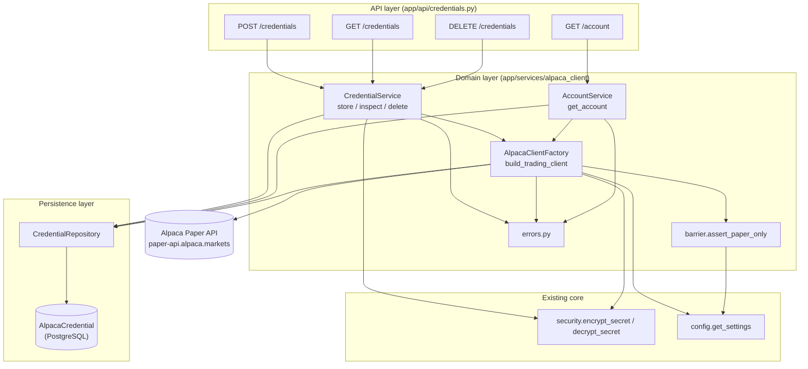
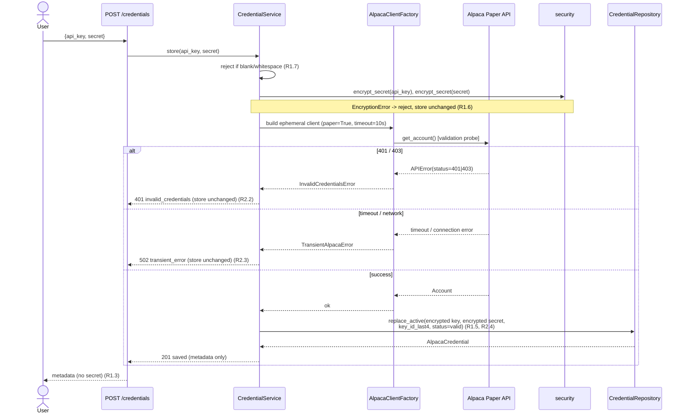

# Design Document

## Overview

This spec implements the base connection layer between TradeBot and the official Alpaca API, operating **exclusively in paper trading mode** (`https://paper-api.alpaca.markets`). It is the foundation for later specs (data feed, order execution, risk management, bot API), all of which obtain an authenticated Alpaca client only through this layer's `AlpacaClientFactory`.

The layer covers six capabilities, mapped to requirements R1–R6:

- **R1** Securely store Alpaca credentials (Fernet-encrypted, exactly one active set).
- **R2** Validate credentials against Alpaca, distinguishing invalid (401/403) from transient (timeout/network) failures.
- **R3** Query account status and balance.
- **R4** Build an authenticated client on demand through a single factory that discards the secret after construction.
- **R5** Enforce a hard paper-trading-only barrier at startup and at client construction.
- **R6** Inspect (metadata only) and remove stored credentials.

### Fit within the monorepo

The design slots into the existing backend structure without changing the established primitives:

| Existing asset | Role in this layer |
| --- | --- |
| `app/core/config.py` (`Settings`, `get_settings`) | Source of `alpaca_paper_base_url`, `alpaca_paper_only`, `app_encryption_key`. |
| `app/core/security.py` (`encrypt_secret`, `decrypt_secret`, `EncryptionError`) | Fernet encrypt/decrypt of API key and secret at rest. |
| `app/db/session.py` (`engine`, `SessionLocal`, `get_db`) | SQLAlchemy 2.0 session; the new model binds to the shared `engine`. |
| `app/main.py` (FastAPI app, `/health`, CORS) | Mount point for the new credentials/account router and the startup paper-only barrier. |
| `app/services/` | New `services/alpaca_client/` domain package. |
| `app/api/` | New REST router. |
| `app/schemas/` | New Pydantic request/response models. |

New files introduced:

```
backend/app/
  db/
    base.py                      # DeclarativeBase + metadata (shared)
    models/alpaca_credential.py  # AlpacaCredential ORM model
  services/alpaca_client/
    __init__.py
    repository.py                # CredentialRepository (persistence)
    credential_service.py        # CredentialService (store/inspect/delete + validation)
    factory.py                   # AlpacaClientFactory (build_trading_client)
    account_service.py           # AccountService (get_account)
    errors.py                    # domain error hierarchy
    barrier.py                   # paper-only barrier check
  schemas/alpaca.py              # Pydantic request/response models
  api/credentials.py             # REST router
```

## Architecture

The layer is organized in four horizontal layers. Only this layer touches the `Credential_Store`; other components reach Alpaca strictly through the factory (Isolation NFR).



### Credential save + validate sequence

Validation runs against Alpaca **before** persistence, so an invalid or transient result leaves the store unchanged (R2.2, R2.3).



### Key design decisions

- **Validate-before-persist.** The service builds an ephemeral client and probes `get_account()` before writing anything. This guarantees R2.2/R2.3 ("store unchanged" on failure) without needing a rollback path.
- **Single active credential set.** `replace_active` deletes any existing row inside the same transaction before inserting the new one, enforcing R1.5 ("exactly one active set").
- **Metadata-only exposure.** Pydantic response models never include a secret field; only `exists`, `key_id_last4`, `validation_status` are exposed (R1.3, R6.1).
- **Paper-only barrier in two places.** At startup (fail fast, R5.2) and inside the factory (defense in depth, R5.1) so no client can ever be built against a non-paper URL.
- **Ephemeral secret.** The factory decrypts into local variables passed straight to the SDK constructor and never stores them on `self` or returns them (R4.2, Security NFR 2).

## Components and Interfaces

### Domain errors (`services/alpaca_client/errors.py`)

A small hierarchy lets the router map each cause to a distinct HTTP response (R2.3 "distinguishable", Resilience NFR 2).

```python
class AlpacaClientError(Exception):
    """Base for all errors raised by the Alpaca client layer."""


class CredentialsRequiredError(AlpacaClientError):
    """A field was empty/whitespace, or no credentials are configured."""


class InvalidCredentialsError(AlpacaClientError):
    """Alpaca rejected the credentials with HTTP 401/403."""


class TransientAlpacaError(AlpacaClientError):
    """Timeout (>10s) or network failure reaching Alpaca."""


class AccountQueryError(AlpacaClientError):
    """Alpaca returned a non-auth error while querying the account."""


class PaperOnlyViolationError(AlpacaClientError):
    """Configuration targets a non-paper base URL while ALPACA_PAPER_ONLY is true."""
```

`EncryptionError` from `app.core.security` is reused as-is (R1.6).

### Paper-only barrier (`services/alpaca_client/barrier.py`)

```python
from app.core.config import Settings

PAPER_BASE_URL = "https://paper-api.alpaca.markets"

def assert_paper_only(settings: Settings) -> None:
    """Raise PaperOnlyViolationError if paper-only is on but the base URL is not paper.

    Called at application startup (R5.2) and by the factory (R5.1).
    """
```

Wired into startup in `app/main.py`:

```python
from app.services.alpaca_client.barrier import assert_paper_only

@app.on_event("startup")
def _enforce_paper_only() -> None:
    assert_paper_only(get_settings())  # refuses to start on misconfiguration (R5.2)
```

### Repository (`services/alpaca_client/repository.py`)

Encapsulates all persistence. Callers pass already-encrypted values; the repository never encrypts or decrypts.

```python
from sqlalchemy.orm import Session
from app.db.models.alpaca_credential import AlpacaCredential

class CredentialRepository:
    def __init__(self, db: Session) -> None: ...

    def get_active(self) -> AlpacaCredential | None:
        """Return the single active credential row, or None."""

    def replace_active(
        self,
        *,
        encrypted_api_key: str,
        encrypted_api_secret: str,
        key_id_last4: str,
        validation_status: str,
    ) -> AlpacaCredential:
        """Delete any existing row and insert a new one in one transaction (R1.5)."""

    def delete_active(self) -> bool:
        """Delete the active row. Return True if a row was removed (R6.3/R6.4)."""
```

### Credential service (`services/alpaca_client/credential_service.py`)

Orchestrates validation, encryption and persistence. Depends on the repository and the factory.

```python
from app.schemas.alpaca import CredentialMetadata, DeletionResult

class CredentialService:
    def __init__(
        self,
        repository: CredentialRepository,
        factory: "AlpacaClientFactory",
    ) -> None: ...

    def store(self, api_key: str, secret: str) -> CredentialMetadata:
        """Validate against Alpaca, then encrypt + persist as the single active set.

        Raises:
            CredentialsRequiredError: api_key or secret blank/whitespace (R1.7).
            EncryptionError: APP_ENCRYPTION_KEY missing/invalid (R1.6).
            InvalidCredentialsError: Alpaca returned 401/403 (R2.2).
            TransientAlpacaError: timeout/network failure (R2.3).
        On any failure the Credential_Store is left unchanged.
        """

    def inspect(self) -> CredentialMetadata:
        """Return metadata only: exists, key_id_last4, validation_status (R6.1/R6.2).
        Never decrypts the secret."""

    def delete(self) -> DeletionResult:
        """Remove the active credential set if present (R6.3/R6.4)."""
```

`store` derives `key_id_last4` from the last 4 characters of the plaintext API key before discarding it, and validates via `factory.validate(api_key, secret)`.

### Client factory (`services/alpaca_client/factory.py`)

The single authenticated-client builder for the whole backend (R4).

```python
from alpaca.trading.client import TradingClient
from app.core.config import Settings

class AlpacaClientFactory:
    def __init__(self, repository: CredentialRepository, settings: Settings) -> None: ...

    def build_trading_client(self) -> TradingClient:
        """Decrypt stored credentials in memory and build a paper TradingClient (R4.1).

        Raises CredentialsRequiredError if no valid credentials exist (R4.3).
        The decrypted secret is confined to this method's scope and discarded on
        return (R4.2, Security NFR 2). Enforces the paper-only barrier (R5.1).
        """

    def validate(self, api_key: str, secret: str) -> None:
        """Build an ephemeral client with a 10s timeout and probe get_account().

        Raises InvalidCredentialsError on 401/403, TransientAlpacaError on
        timeout/network failure. Used during store() before persistence (R2.1).
        """
```

Implementation notes:

- `build_trading_client` and `validate` both call `assert_paper_only(self._settings)` and construct `TradingClient(api_key, secret, paper=True)`, which targets `https://paper-api.alpaca.markets` (R5.1).
- The 10-second `Validation_Timeout` is applied through the SDK's underlying HTTP client (configuring the request session timeout to 10s). Timeouts and connection errors are caught and re-raised as `TransientAlpacaError`; `alpaca.common.exceptions.APIError` with status 401/403 becomes `InvalidCredentialsError`; other `APIError` becomes `AccountQueryError`.
- Decrypted values live only as local variables passed to the constructor; nothing is assigned to `self`.

### Account service (`services/alpaca_client/account_service.py`)

```python
from app.schemas.alpaca import AccountStatus

class AccountService:
    def __init__(
        self,
        repository: CredentialRepository,
        factory: AlpacaClientFactory,
    ) -> None: ...

    def get_account(self) -> AccountStatus:
        """Return cash, buying_power, account status and mode='paper' (R3.1, R5.3).

        Raises:
            CredentialsRequiredError: no credentials configured; Alpaca is NOT
                called (R3.2).
            AccountQueryError: Alpaca error or timeout (>10s); backend stays up,
                store unchanged (R3.3).
            TransientAlpacaError: network/timeout failure (R3.3).
        """
```

`get_account` first checks `repository.get_active()`; if absent it raises `CredentialsRequiredError` **without** building a client (R3.2). Otherwise it builds the client via the factory and reads `cash`, `buying_power`, `status` from the Alpaca `Account`.

### REST router (`api/credentials.py`)

Uses `Depends(get_db)` and wires the repository/services per request. Mounted in `app/main.py` via `app.include_router(...)`.

| Method & path | Purpose | Success | Req |
| --- | --- | --- | --- |
| `POST /credentials` | Submit and validate credentials | `201` `CredentialMetadata` | R1, R2 |
| `GET /credentials` | Inspect stored metadata | `200` `CredentialMetadata` | R6.1, R6.2 |
| `DELETE /credentials` | Remove stored credentials | `200` `DeletionResult` | R6.3, R6.4 |
| `GET /account` | Query paper account/balance | `200` `AccountStatus` | R3, R5.3 |

```python
from fastapi import APIRouter, Depends, status
from sqlalchemy.orm import Session
from app.db.session import get_db
from app.schemas.alpaca import (
    CredentialSubmit, CredentialMetadata, DeletionResult, AccountStatus,
)

router = APIRouter(prefix="/credentials", tags=["alpaca"])
account_router = APIRouter(prefix="/account", tags=["alpaca"])

@router.post("", status_code=status.HTTP_201_CREATED, response_model=CredentialMetadata)
def submit_credentials(body: CredentialSubmit, db: Session = Depends(get_db)) -> CredentialMetadata: ...

@router.get("", response_model=CredentialMetadata)
def get_credentials(db: Session = Depends(get_db)) -> CredentialMetadata: ...

@router.delete("", response_model=DeletionResult)
def delete_credentials(db: Session = Depends(get_db)) -> DeletionResult: ...

@account_router.get("", response_model=AccountStatus)
def get_account(db: Session = Depends(get_db)) -> AccountStatus: ...
```

## Data Models

### ORM model (`db/models/alpaca_credential.py`)

Introduce a shared `DeclarativeBase` in `db/base.py` (so future specs reuse it) and bind the model to the existing `engine`.

```python
# db/base.py
from sqlalchemy.orm import DeclarativeBase

class Base(DeclarativeBase):
    pass
```

```python
# db/models/alpaca_credential.py
from datetime import datetime
from sqlalchemy import DateTime, String, func
from sqlalchemy.orm import Mapped, mapped_column
from app.db.base import Base

class AlpacaCredential(Base):
    __tablename__ = "alpaca_credentials"

    id: Mapped[int] = mapped_column(primary_key=True)
    encrypted_api_key: Mapped[str] = mapped_column(String, nullable=False)
    encrypted_api_secret: Mapped[str] = mapped_column(String, nullable=False)
    key_id_last4: Mapped[str] = mapped_column(String(4), nullable=False)
    validation_status: Mapped[str] = mapped_column(String(16), nullable=False, default="valid")
    created_at: Mapped[datetime] = mapped_column(DateTime(timezone=True), server_default=func.now())
    updated_at: Mapped[datetime] = mapped_column(
        DateTime(timezone=True), server_default=func.now(), onupdate=func.now()
    )
```

Notes:

- `encrypted_api_key` / `encrypted_api_secret` hold Fernet tokens only — never plaintext (R1.2).
- `key_id_last4` and `validation_status` are the only non-sensitive fields exposed to the frontend (R6.1).
- `validation_status` values: `"valid"` (set after a successful probe, R2.4). The schema keeps room for future statuses without changing the column type.
- Table creation: for this phase, `Base.metadata.create_all(bind=engine)` at startup is acceptable; a migration tool can be introduced in a later spec.

### Pydantic schemas (`schemas/alpaca.py`)

```python
from datetime import datetime
from decimal import Decimal
from typing import Literal
from pydantic import BaseModel, Field, field_validator

class CredentialSubmit(BaseModel):
    api_key: str = Field(min_length=1)
    secret: str = Field(min_length=1)

    @field_validator("api_key", "secret")
    @classmethod
    def _not_blank(cls, v: str) -> str:
        if not v.strip():
            raise ValueError("field is required")  # R1.7
        return v

class CredentialMetadata(BaseModel):
    exists: bool
    key_id_last4: str | None = None       # last 4 of API Key ID (R6.1)
    validation_status: str | None = None  # e.g. "valid" (R6.1)
    updated_at: datetime | None = None
    # No secret field anywhere (R1.3)

class DeletionResult(BaseModel):
    deleted: bool
    detail: str  # e.g. "credentials removed" or "no credentials to delete" (R6.3/R6.4)

class AccountStatus(BaseModel):
    cash: Decimal            # numeric monetary value (R3.1)
    buying_power: Decimal    # numeric monetary value (R3.1)
    status: str              # account status reported by Alpaca (R3.1)
    mode: Literal["paper"] = "paper"  # Active_Mode (R5.3)
```

`CredentialSubmit` is the only place a plaintext secret appears in a schema, and it is inbound only; no response model can serialize it.

## Correctness Properties

*A property is a characteristic or behavior that should hold true across all valid executions of a system—essentially, a formal statement about what the system should do. Properties serve as the bridge between human-readable specifications and machine-verifiable correctness guarantees.*

These properties target the pure/deterministic logic of this layer (encryption, credential lifecycle, error classification, response mapping) with Alpaca mocked. They are written for property-based testing (minimum 100 iterations each).

### Property 1: Encryption round-trip never exposes plaintext

*For any* non-empty credential string, encrypting it produces a token that differs from the plaintext, and decrypting that token returns exactly the original string.

**Validates: Requirements 1.1, 1.2**

### Property 2: Exactly one active set that matches the last successful store

*For any* non-empty sequence of successful credential submissions, after processing them the Credential_Store contains exactly one active credential set, and that set decrypts to the most recently submitted key/secret with `validation_status == "valid"`.

**Validates: Requirements 1.5, 2.4**

### Property 3: Metadata output never contains the secret

*For any* stored credentials, the serialized inspection/response payload contains no field carrying the decrypted secret (or the decrypted API key), exposing only `exists`, `key_id_last4`, and `validation_status`.

**Validates: Requirements 1.3, 6.1**

### Property 4: 401/403 maps to InvalidCredentialsError and leaves the store unchanged

*For any* prior store state and any auth status in {401, 403} returned by Alpaca during validation, `store` raises `InvalidCredentialsError` and the Credential_Store is byte-for-byte unchanged.

**Validates: Requirements 2.2**

### Property 5: Timeout/network failures map to a distinguishable TransientAlpacaError

*For any* timeout or network-level failure raised during validation, `store` raises `TransientAlpacaError` (never `InvalidCredentialsError`) and the Credential_Store is left unchanged.

**Validates: Requirements 2.3**

### Property 6: Account response preserves Alpaca values

*For any* Alpaca account payload, the returned `AccountStatus` exposes `cash` and `buying_power` as numeric monetary values equal to the payload amounts, preserves the reported account `status`, and sets `mode == "paper"`.

**Validates: Requirements 3.1, 5.3**

### Property 7: Every built client targets the paper endpoint

*For any* stored credentials, every client the factory constructs is configured for paper trading (`paper=True`, base URL `https://paper-api.alpaca.markets`).

**Validates: Requirements 4.1, 5.1**

### Property 8: Paper-only barrier rejects non-paper URLs

*For any* base URL that is not the paper endpoint, while `ALPACA_PAPER_ONLY` is true, `assert_paper_only` raises `PaperOnlyViolationError`; for the paper endpoint it does not raise.

**Validates: Requirements 5.2**

### Property 9: Delete is idempotent and observable

*For any* store state, calling `delete` leaves the Credential_Store empty; it reports `deleted == True` when a set was present and `deleted == False` when none existed, and never raises a fatal error.

**Validates: Requirements 6.3, 6.4**

### Property 10: Whitespace-only fields are always rejected

*For any* api_key or secret consisting solely of whitespace, `store` raises `CredentialsRequiredError` and the Credential_Store is left unchanged.

**Validates: Requirements 1.7**

### Property 11: Factory rebuilds credentials faithfully

*For any* stored credentials, the client the factory builds is constructed with the key and secret equal to the originally submitted plaintext values (decrypt correctness end to end).

**Validates: Requirements 4.1**

### Property 12: Decrypted secret is not retained on the factory

*For any* stored credentials, after `build_trading_client` returns, no attribute of the factory instance holds the plaintext secret; the secret exists only during construction.

**Validates: Requirements 4.2**

## Error Handling

Each domain error maps to a distinct, distinguishable HTTP response so the frontend can tell an authentication problem from a transient one (R2.3, Resilience NFR 2). Plaintext credentials never appear in any message (R1.4).

| Cause | Domain error | HTTP status | Response detail (no secrets) | Store effect | Req |
| --- | --- | --- | --- | --- | --- |
| Empty/whitespace field | `CredentialsRequiredError` (from validation) | `422` (Pydantic) / `400` | "field is required" | unchanged | R1.7 |
| `APP_ENCRYPTION_KEY` missing/invalid | `EncryptionError` | `503` | "encryption key unavailable or invalid" | unchanged | R1.6 |
| Alpaca 401/403 | `InvalidCredentialsError` | `401` | "invalid Alpaca credentials" | unchanged | R2.2 |
| Timeout (>10s) / network error | `TransientAlpacaError` | `502` | "temporary problem reaching Alpaca, try again" | unchanged | R2.3, R3.3 |
| Non-auth Alpaca error on account query | `AccountQueryError` | `502` | "account query failed" | unchanged, process stays up | R3.3 |
| No credentials configured | `CredentialsRequiredError` | `409` | "no credentials configured" | unchanged, Alpaca not called | R3.2, R4.3 |
| Non-paper URL while paper-only | `PaperOnlyViolationError` | startup abort / `500` | "paper-only barrier violation" (observable at startup) | n/a | R5.2 |

Handling rules:

- **Distinguishability.** `401` (invalid) and `502` (transient) use different status codes and stable `error_code` fields (`invalid_credentials`, `transient_error`) so callers can branch programmatically (R2.3).
- **No secret leakage.** The router builds messages from static strings and metadata only; exception chains from `security`/SDK are caught and re-wrapped so raw values never propagate to logs or responses (R1.4).
- **Process resilience.** Account-query failures are caught at the router boundary and returned as HTTP errors; they never crash the backend (R3.3).
- **Startup barrier.** `assert_paper_only` runs before the app serves traffic; a violation aborts startup with a clear log line (R5.2).
- **Registered handlers.** FastAPI exception handlers map each `AlpacaClientError` subclass to its status/`error_code`, keeping the router handlers thin.

## Testing Strategy

Property-based testing **is appropriate** here: encryption, the credential lifecycle, error classification, and account-response mapping are deterministic logic with clear input/output behavior and large input spaces. External I/O (the Alpaca SDK) is mocked so tests stay fast and cost-free.

### Tooling

- **Framework:** `pytest` (already configured in `backend/pyproject.toml` / `tests/`).
- **Property-based library:** [Hypothesis](https://hypothesis.readthedocs.io/) for Python. Do not hand-roll property testing.
- **Mocking:** `unittest.mock` (or `pytest-mock`) to stub `alpaca.trading.client.TradingClient` and `get_account`; no real network calls.
- **DB:** an in-memory or ephemeral SQLite/Postgres test session bound to the model metadata, or the repository exercised against a transactional session that rolls back per test.

### Property tests (min. 100 iterations each)

Each property test carries a comment tag: **Feature: 01-alpaca-client, Property {n}: {property text}**.

| Property | Focus | Notes |
| --- | --- | --- |
| P1 | Encryption round-trip / no plaintext | Extends `backend/tests/test_security.py`; generate random non-empty strings. |
| P2 | Single active set, status `valid` | Sequence of stores with mocked success; assert count == 1 and matches last. |
| P3 | Metadata never contains secret | Assert secret substring absent from serialized `CredentialMetadata`. |
| P4 | 401/403 → InvalidCredentialsError, store unchanged | Parametrize status over {401,403} within the generator. |
| P5 | Timeout/network → TransientAlpacaError | Generate timeout/connection exceptions; assert not InvalidCredentialsError. |
| P6 | Account mapping preserves values, mode=paper | Generate account payloads with varied cash/buying_power/status. |
| P7 | Every client uses paper=True | Inspect mocked `TradingClient` constructor kwargs. |
| P8 | Barrier rejects non-paper URLs | Generate non-paper URLs; paper URL must pass. |
| P9 | Delete idempotent and observable | Random store states; delete twice. |
| P10 | Whitespace fields rejected | Generate whitespace-only strings. |
| P11 | Factory decrypt correctness | Assert constructor received original key/secret. |
| P12 | Secret not retained on factory | Inspect factory instance attributes post-build. |

### Unit / example tests

- **Validate-before-persist ordering (R2.1):** with a mocked client, assert validation is invoked before any repository write.
- **Encryption key missing/invalid (R1.6):** unset/garbage `APP_ENCRYPTION_KEY` → `EncryptionError`, store unchanged. (Reuse `test_security.py` fixtures.)
- **Account query without credentials (R3.2):** empty store → `CredentialsRequiredError`, and the factory/client is never called (mock spy).
- **Factory without valid credentials (R4.3):** empty store → `CredentialsRequiredError`, no client returned.
- **Inspect with none (R6.2):** empty store → `exists=False`, no exception.
- **Active mode constant (R5.3):** successful account query → `mode == "paper"`.
- **No secret in logs/errors (R1.4):** trigger each error path; assert captured logs and exception messages exclude the plaintext.

### Integration / smoke tests

- **Startup paper-only barrier (R5.2):** boot the app with a non-paper URL while `ALPACA_PAPER_ONLY=true`; assert startup fails with an observable error, and boots normally with the paper URL.
- **Router wiring:** `TestClient` exercises `POST/GET/DELETE /credentials` and `GET /account` with the Alpaca SDK mocked, asserting the status codes and `error_code` values in the Error Handling table.

### Requirements-to-minimum-tests mapping

| Minimum test (requirements.md) | Covered by |
| --- | --- |
| Encryption round-trip | P1 (extends `test_security.py`) |
| Invalid credentials not persisted | P4 |
| Transient failure handling | P5 |
| Inspection returns metadata only | P3 |
| Factory uses paper base URL | P7 |
| Account query without credentials | Unit test (R3.2) |

### Requirements traceability summary

| Requirement | Components | Tests |
| --- | --- | --- |
| R1 (secure storage) | `security`, `CredentialService.store`, `CredentialRepository.replace_active`, `AlpacaCredential`, schemas | P1, P2, P3, P10; R1.4/R1.6 unit tests |
| R2 (validation) | `AlpacaClientFactory.validate`, `CredentialService.store`, errors | P4, P5, P2; R2.1 ordering test |
| R3 (account/balance) | `AccountService.get_account`, `AlpacaClientFactory`, `AccountStatus` | P6; R3.2 unit test; R3.3 edge |
| R4 (client factory) | `AlpacaClientFactory.build_trading_client` | P7, P11, P12; R4.3 unit test |
| R5 (paper-only barrier) | `barrier.assert_paper_only`, factory, startup hook, `AccountStatus.mode` | P7, P8; R5.2 startup test; R5.3 unit test |
| R6 (inspect/remove) | `CredentialService.inspect/delete`, `CredentialRepository`, schemas | P3, P9; R6.2 unit test |
