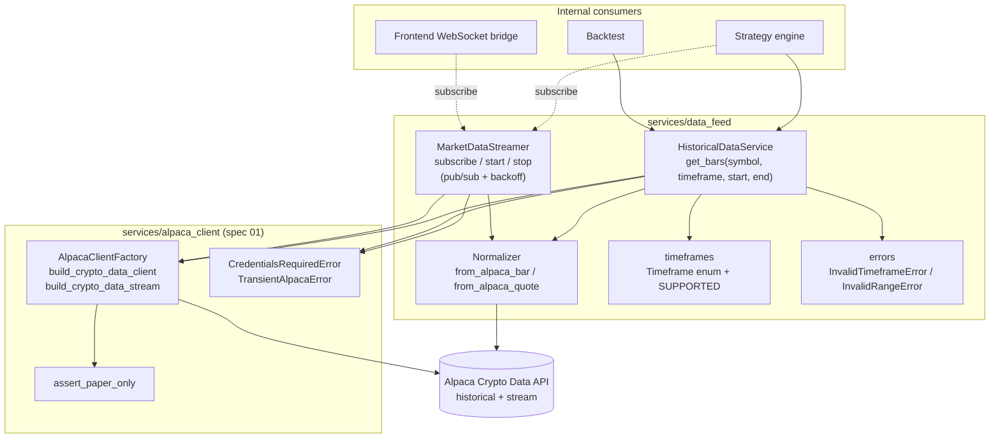
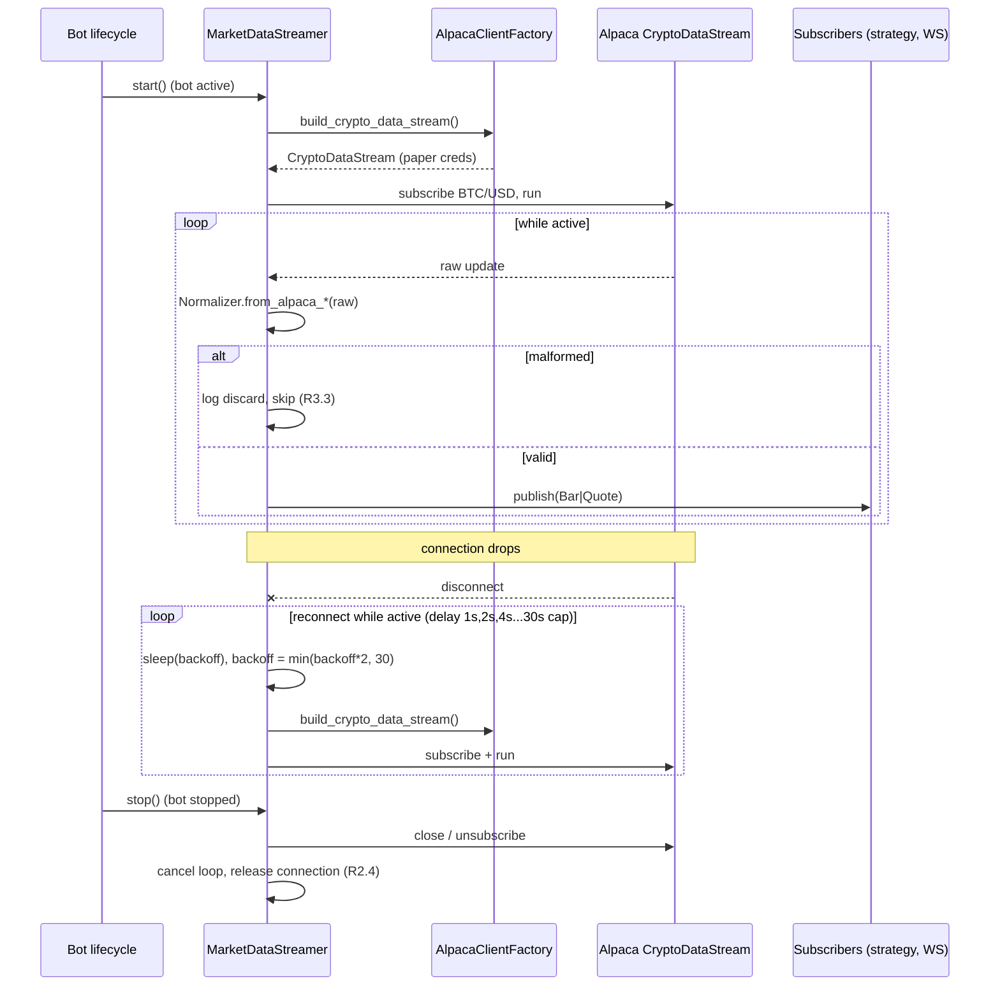

# Design Document

## Overview

This spec implements the BTC/USD market data feed for TradeBot. It provides two data paths built on top of spec `01-alpaca-client`:

- **Historical bars** — `HistoricalDataService.get_bars(...)` for the strategy engine and backtests (R1).
- **Real-time streaming** — `MarketDataStreamer` that subscribes while the bot is active and pushes normalized updates to internal consumers via a publisher/subscriber pattern (R2).

Both paths deliver data exclusively through a single, SDK-independent format — `Bar` and `Quote` — so no downstream component depends on Alpaca's shapes (R3). The authenticated Alpaca **data** client is obtained only through the `AlpacaClientFactory` from spec `01-alpaca-client`, reusing its decrypted credentials and the paper-only barrier.

### Fit within the monorepo

The design adds a new domain package `services/data_feed/` and extends the existing factory to build a crypto data client. It reuses the errors and paper-only guarantees already defined in `services/alpaca_client/`.

| Existing asset | Role in this feature |
| --- | --- |
| `services/alpaca_client/factory.py` (`AlpacaClientFactory`) | Extended with `build_crypto_data_client()` and `build_crypto_data_stream()`; sole source of authenticated data clients (R1.7, R2.1). |
| `services/alpaca_client/errors.py` (`CredentialsRequiredError`, `TransientAlpacaError`) | Reused as-is for missing-credentials and timeout/network failures (R1.8, R1.9). |
| `services/alpaca_client/barrier.py` (`assert_paper_only`) | Applied by the factory when building data clients (paper-only). |
| `app/core/config.py` (`Settings.default_symbol = "BTC/USD"`, `get_settings`) | Default symbol and settings source. |
| `app/api/` | Optional historical-data router. |

New files introduced:

```
backend/app/
  services/data_feed/
    __init__.py
    models.py            # Bar, Quote (single SDK-independent format)
    normalizer.py        # Normalizer: raw Alpaca -> Bar / Quote
    timeframes.py        # Timeframe enum + supported set + SDK mapping
    errors.py            # InvalidTimeframeError, InvalidRangeError
    historical.py        # HistoricalDataService.get_bars(...)
    streaming.py         # MarketDataStreamer (pub/sub + reconnect/backoff)
  api/
    market_data.py       # optional GET /market-data/bars router
```

Reused from spec 01 (extended, not duplicated):

```
backend/app/services/alpaca_client/factory.py   # + build_crypto_data_client / build_crypto_data_stream
```

## Architecture

The feature is a thin domain layer. The `Normalizer` is the single choke point: every datum — historical or streaming — passes through it before reaching any consumer (R3.2). Consumers never see Alpaca types.



### Streaming reconnection sequence

While the bot is active, a dropped connection triggers reconnection with exponential backoff (1s → 30s cap, indefinite) without terminating the process (R2.3). Stopping cancels the subscription and releases the connection (R2.4).



### Key design decisions

- **Factory-only client access.** The data feed never constructs Alpaca clients directly. It calls `AlpacaClientFactory.build_crypto_data_client()` / `build_crypto_data_stream()`, which reuse the decrypted credentials and enforce the paper-only barrier (R1.7, R2.1).
- **Validate before calling Alpaca.** `get_bars` validates timeframe and range purely in-process and raises before any network call (R1.4, R1.5), so invalid input never reaches the SDK.
- **Normalizer as single choke point.** Raw → `Bar`/`Quote` conversion happens in exactly one place for both paths, guaranteeing SDK independence and consistent malformed-data handling (R3.2, R3.3).
- **Pub/sub decoupling.** `MarketDataStreamer` holds a list of callbacks; the strategy engine and WebSocket bridge subscribe independently. The streamer does not know its consumers' concrete types (R2.2).
- **Discard, don't crash.** Malformed data is logged and skipped; processing of subsequent data continues (R3.3). Reconnection never terminates the process (R2.3).

## Components and Interfaces

### Timeframes (`services/data_feed/timeframes.py`)

```python
from enum import Enum

class Timeframe(str, Enum):
    """Supported bar aggregation intervals (R1.4)."""
    MIN_1 = "1Min"
    MIN_5 = "5Min"
    MIN_15 = "15Min"
    HOUR_1 = "1Hour"
    DAY_1 = "1Day"

SUPPORTED_TIMEFRAMES: frozenset[str] = frozenset(tf.value for tf in Timeframe)

def to_alpaca_timeframe(tf: Timeframe):
    """Map a Timeframe to the alpaca-py TimeFrame object (amount + unit)."""
```

### Errors (`services/data_feed/errors.py`)

Only two new errors are introduced; missing-credentials and transient failures reuse spec 01.

```python
class DataFeedError(Exception):
    """Base for data feed domain errors."""

class InvalidTimeframeError(DataFeedError):
    """Requested timeframe is not one of the supported values (R1.4)."""

class InvalidRangeError(DataFeedError):
    """Date range is invalid: start after end, or missing/unparseable date (R1.5)."""
```

Reused from `services/alpaca_client/errors.py`:
`CredentialsRequiredError` (R1.8), `TransientAlpacaError` (R1.9).

### Normalizer (`services/data_feed/normalizer.py`)

Single conversion point. Returns `None` for malformed data so callers discard-and-log uniformly (R3.3).

```python
from app.services.data_feed.models import Bar, Quote

class Normalizer:
    @staticmethod
    def from_alpaca_bar(raw) -> Bar | None:
        """Convert a raw Alpaca bar to Bar. Return None if any required field
        (timestamp, open, high, low, close, volume) is missing/unparseable (R3.2, R3.3)."""

    @staticmethod
    def from_alpaca_quote(raw) -> Quote | None:
        """Convert a raw Alpaca quote/trade to Quote. Return None if timestamp or
        price is missing/unparseable (R3.2, R3.3)."""
```

Handling of missing fields: each accessor is read defensively (attribute or key); any missing/`None`/unparseable required field causes the method to return `None`. The caller logs the discard and continues.

### Historical data service (`services/data_feed/historical.py`)

```python
from datetime import datetime
from app.services.alpaca_client.factory import AlpacaClientFactory
from app.services.data_feed.models import Bar
from app.services.data_feed.timeframes import Timeframe

class HistoricalDataService:
    def __init__(self, factory: AlpacaClientFactory) -> None: ...

    def get_bars(
        self,
        symbol: str,
        timeframe: Timeframe | str,
        start: datetime,
        end: datetime,
    ) -> list[Bar]:
        """Return normalized BTC/USD bars ordered by timestamp ascending (R1.1, R1.2).

        Validation runs BEFORE any Alpaca call:
            - timeframe not in SUPPORTED_TIMEFRAMES  -> InvalidTimeframeError (R1.4)
            - start missing/unparseable, end missing, or start > end -> InvalidRangeError (R1.5)

        Behavior:
            - No data for the range -> [] (empty list, no error) (R1.3)
            - > 10,000 bars -> paginate internally, single ordered list, no duplicates (R1.6)
            - client obtained via factory.build_crypto_data_client() (R1.7)

        Raises:
            CredentialsRequiredError: no credentials configured; Alpaca NOT called (R1.8)
            TransientAlpacaError: timeout (>10s) / network error (R1.9)
        """
```

Pagination: the service loops using Alpaca's page token (or advancing the request `start` past the last returned bar timestamp) until no next page remains, accumulating results. Before returning, bars are deduplicated by timestamp and sorted ascending, so the >10,000-bar path yields one ordered list without duplicates (R1.6).

### Market data streamer (`services/data_feed/streaming.py`)

Publisher/subscriber with an async reconnection loop.

```python
from typing import Callable
from app.services.alpaca_client.factory import AlpacaClientFactory
from app.services.data_feed.models import Bar, Quote

MarketDataCallback = Callable[[Bar | Quote], None]

class MarketDataStreamer:
    def __init__(self, factory: AlpacaClientFactory, symbol: str = "BTC/USD") -> None: ...

    def subscribe(self, callback: MarketDataCallback) -> None:
        """Register an internal consumer (strategy engine, WebSocket bridge). (R2.2)"""

    def unsubscribe(self, callback: MarketDataCallback) -> None: ...

    async def start(self) -> None:
        """Bot became active: build the stream via factory, subscribe to BTC/USD,
        and run the receive loop. On disconnect, reconnect with exponential backoff
        (1s doubling to a 30s cap, indefinitely while active) without crashing the
        process (R2.1, R2.3)."""

    async def stop(self) -> None:
        """Bot stopped: cancel the subscription and release the Alpaca connection (R2.4)."""

    def _publish(self, datum: Bar | Quote) -> None:
        """Fan out a normalized datum to all subscribers (R2.2)."""
```

Backoff loop: `delay = 1`; after each failed connection, `delay = min(delay * 2, 30)`; reset to 1 on a successful connection. The loop runs while an internal `_active` flag is set; `stop()` clears it and closes the stream (R2.3, R2.4). Each raw update is passed through `Normalizer`; `None` results are logged and skipped (R3.3).

### Optional HTTP router (`api/market_data.py`)

Optional REST surface for historical bars, useful for the frontend/backtest UI.

| Method & path | Purpose | Success | Req |
| --- | --- | --- | --- |
| `GET /market-data/bars?symbol&timeframe&start&end` | Fetch historical bars | `200` `list[BarOut]` | R1 |

```python
from fastapi import APIRouter, Depends, Query
from datetime import datetime

router = APIRouter(prefix="/market-data", tags=["market-data"])

@router.get("/bars")
def get_bars(
    timeframe: str = Query(...),
    start: datetime = Query(...),
    end: datetime = Query(...),
    symbol: str = Query("BTC/USD"),
): ...
```

## Data Models

### Single normalization format (`services/data_feed/models.py`)

The only market-data shapes any consumer sees. Implemented as immutable dataclasses (pure data, no SDK types).

```python
from dataclasses import dataclass
from datetime import datetime
from decimal import Decimal

@dataclass(frozen=True)
class Bar:
    """SDK-independent OHLCV candle — exactly these fields (R3.1)."""
    timestamp: datetime
    open: Decimal
    high: Decimal
    low: Decimal
    close: Decimal
    volume: Decimal

@dataclass(frozen=True)
class Quote:
    """SDK-independent tick/quote — exactly these fields (R3.1)."""
    timestamp: datetime
    price: Decimal
```

Validation / normalization rules:

- `Normalizer.from_alpaca_bar` / `from_alpaca_quote` are the only constructors used for external data. They read each required field defensively and return `None` on any missing/unparseable field (R3.3).
- Numeric fields use `Decimal` to preserve monetary precision (consistent with spec 01's `AccountStatus`).
- Timestamps are normalized to timezone-aware `datetime` (UTC).
- The optional HTTP router exposes a Pydantic `BarOut` mirror for serialization; the internal format stays `Bar`.

## Error Handling

Validation errors are raised in-process before any Alpaca call; missing-credentials and transient errors are reused from spec 01 so the whole backend classifies failures consistently (R1.9 "distinguishable").

| Cause | Error | Origin | Alpaca called? | Req |
| --- | --- | --- | --- | --- |
| Unsupported timeframe | `InvalidTimeframeError` | data_feed (new) | No | R1.4 |
| start > end / missing / unparseable date | `InvalidRangeError` | data_feed (new) | No | R1.5 |
| No credentials configured | `CredentialsRequiredError` | spec 01 (reused) | No | R1.8 |
| Timeout (>10s) / network error | `TransientAlpacaError` | spec 01 (reused) | Yes (failed) | R1.9 |
| No bars for range | none — returns `[]` | data_feed | Yes | R1.3 |
| Malformed streaming/historical datum | none — discarded + logged | Normalizer | n/a | R3.3 |

Handling rules:

- **Fail fast on invalid input.** `get_bars` validates timeframe and range first; on failure it raises without touching the factory or SDK (R1.4, R1.5), and a spy on the factory confirms it was never called.
- **Empty is not an error.** No bars for a valid range returns `[]` and never raises (R1.3).
- **Discard, log, continue.** A malformed datum is logged (with symbol and reason, no secrets) and skipped; the streamer and paginator keep processing subsequent data (R3.3).
- **Process resilience.** Streaming reconnection is bounded per-attempt (30s cap) but retries indefinitely while active, and never lets an exception terminate the process (R2.3).

If the optional HTTP router is exposed, errors map to distinguishable codes:

| Error | HTTP status | error_code |
| --- | --- | --- |
| `InvalidTimeframeError` | `400` | `invalid_timeframe` |
| `InvalidRangeError` | `400` | `invalid_range` |
| `CredentialsRequiredError` | `409` | `no_credentials` |
| `TransientAlpacaError` | `502` | `transient_error` |

## Correctness Properties

*A property is a characteristic or behavior that should hold true across all valid executions of a system—essentially, a formal statement about what the system should do. Properties serve as the bridge between human-readable specifications and machine-verifiable correctness guarantees.*

These target the deterministic logic of the feature (validation, normalization, ordering, pagination, malformed-data discard) with Alpaca mocked. Each is written for property-based testing (minimum 100 iterations).

### Property 1: Returned bars are normalized and ascending

*For any* set of raw Alpaca bars for a valid timeframe and range, every element of `get_bars`'s result is a `Bar` exposing exactly (timestamp, open, high, low, close, volume), and the list is sorted by timestamp ascending.

**Validates: Requirements 1.1, 1.2, 3.1, 3.2**

### Property 2: A range with no data yields an empty list

*For any* valid timeframe and range for which the mocked client returns no bars, `get_bars` returns `[]` and raises no error.

**Validates: Requirements 1.3**

### Property 3: Invalid timeframe or range fails without calling Alpaca

*For any* timeframe outside the supported set, or any range where start is after end / a date is missing or unparseable, `get_bars` raises `InvalidTimeframeError` or `InvalidRangeError` respectively, and the factory/client is never invoked.

**Validates: Requirements 1.4, 1.5, 1.7**

### Property 4: Malformed data is discarded and never delivered

*For any* raw datum missing at least one field required by its format, the `Normalizer` returns `None`, no `Bar`/`Quote` is delivered to any consumer, and processing of the remaining data continues unaffected.

**Validates: Requirements 3.2, 3.3**

### Property 5: Pagination produces one ordered list with no duplicates

*For any* multi-page sequence of raw bars (including the >10,000-bar path), the assembled result contains each bar timestamp at most once and is sorted ascending, independent of page boundaries.

**Validates: Requirements 1.6, 1.2**

### Property 6: Reconnection backoff stays within bounds

*For any* sequence of consecutive connection failures while active, the reconnection delays follow the schedule starting at 1s and doubling, never exceeding the 30s cap, and the loop continues (does not terminate) while the bot remains active.

**Validates: Requirements 2.3**

## Testing Strategy

Property-based testing **is appropriate**: validation, normalization, ordering, pagination assembly, and backoff scheduling are deterministic logic with clear input/output behavior and large input spaces. The Alpaca SDK (data client and stream) is mocked so tests are fast and network-free.

### Tooling

- **Framework:** `pytest` (configured in `backend/pyproject.toml` / `tests/`).
- **Property-based library:** [Hypothesis](https://hypothesis.readthedocs.io/) — do not hand-roll property testing.
- **Mocking:** `unittest.mock` / `pytest-mock` to stub `AlpacaClientFactory.build_crypto_data_client` / `build_crypto_data_stream` and the SDK responses. A fake stream simulates disconnects for reconnection tests. No real network calls.
- **Async:** `pytest-asyncio` for the streamer's `start`/`stop`/reconnect loop.

### Property tests (min. 100 iterations each)

Each test carries a comment tag: **Feature: 02-data-feed, Property {n}: {property text}**.

| Property | Focus | Notes |
| --- | --- | --- |
| P1 | Normalized + ascending output | Generate raw bars in random order; assert sorted, correct fields. |
| P2 | Empty range → `[]` | Mock returns no bars for valid inputs. |
| P3 | Invalid timeframe/range → error, no Alpaca call | Factory as spy; assert never called. |
| P4 | Malformed discarded, never delivered | Drop a random required field; assert `None` + continuation. |
| P5 | Pagination: no duplicates, ordered | Multi-page fake with overlapping tokens. |
| P6 | Backoff schedule within bounds | Simulate N failures; assert 1,2,4,…,30 cap and loop continues. |

### Unit / example tests

- **Bar normalization example (Minimum Tests):** one representative Alpaca bar → correct `Bar`.
- **Empty range with mocked client (Minimum Tests):** valid request, no data → `[]`.
- **Reconnection/backoff with simulated disconnect (Minimum Tests):** covered by P6 plus an example asserting `stop()` releases the connection (R2.4).
- **Malformed datum discarded (Minimum Tests):** one malformed + one valid → only the valid is delivered (R3.3).
- **Historical request without credentials (Minimum Tests):** empty store → `CredentialsRequiredError`, factory client never built (R1.8).
- **Transient failure (R1.9):** mocked timeout/network error → `TransientAlpacaError`, process stays up.
- **Streaming subscribe/publish (R2.2):** register two callbacks, feed one update, assert both receive the normalized datum.

### Requirements-to-minimum-tests mapping

| Minimum test (requirements.md) | Covered by |
| --- | --- |
| Normalization of an Alpaca bar | P1 + normalization example |
| Empty range returns empty list | P2 |
| Reconnection and backoff | P6 + `stop()` release example |
| Malformed datum discarded | P4 |
| Historical request without credentials | Unit test (R1.8) |

### Requirements traceability summary

| Requirement | Components | Tests |
| --- | --- | --- |
| R1 (historical bars) | `HistoricalDataService.get_bars`, `timeframes`, `errors`, `Normalizer`, `AlpacaClientFactory` | P1, P2, P3, P5; R1.8/R1.9 unit tests |
| R2 (streaming) | `MarketDataStreamer` (pub/sub, backoff, start/stop), `AlpacaClientFactory` | P6; R2.2/R2.4 unit tests |
| R3 (single format) | `Bar`, `Quote`, `Normalizer` | P1, P4 |
