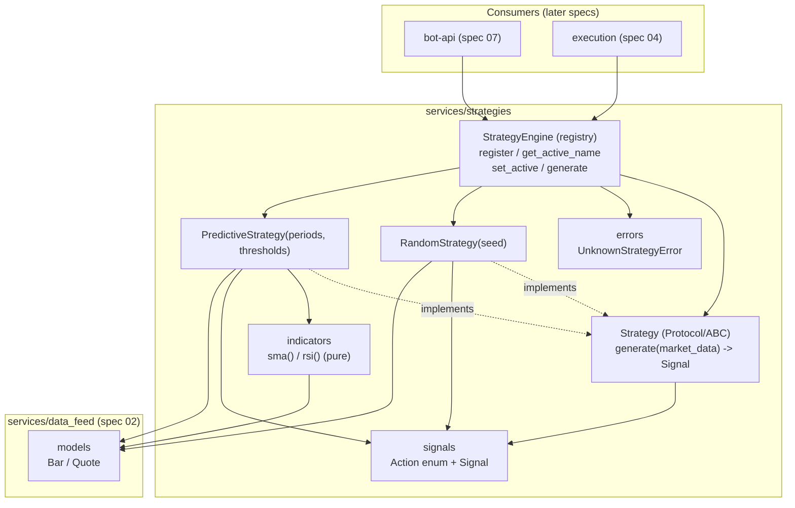

# Design Document

## Overview

This spec implements the **strategy engine** for TradeBot: the component that turns BTC/USD market data into trading signals. Each signal carries an action that is exactly one of `BUY`, `SELL`, or `HOLD`, plus a human-readable reason and a timestamp. The engine defines a plug-and-play `Strategy` interface and ships two selectable strategies:

- **`random`** — a reproducible baseline (seedable) used to sanity-check the whole pipeline end to end (R2).
- **`predictive`** — decisions derived from indicators over historical bars: SMA crossover and/or RSI (R3).

The engine consumes only the single, SDK-independent market-data format from spec `02-data-feed` (`Bar`, `Quote`) and never talks to Alpaca. Mode selection (which strategy is active) is exposed through a registry/engine object; the bot-api (spec `07`) and frontend (spec `08`) drive selection. This spec does **not** expose HTTP endpoints — that belongs to spec 07.

The design covers the four requirements:

- **R1** Common `Strategy` interface + `Signal`, registration/selection by name, clear error on unknown name, every strategy always returns a valid Signal, empty/insufficient data → HOLD.
- **R2** `RandomStrategy` reproducible under a seed, reason indicates randomness.
- **R3** `PredictiveStrategy` over close prices (SMA crossover and/or RSI), configurable periods/thresholds, insufficient bars → HOLD, deterministic, reason names the indicator.
- **R4** `StrategyEngine`: deterministic default active mode, expose active mode, switch between `random`/`predictive` by name, clear error on unknown name without changing the active mode.

### Fit within the monorepo

Per the structure steering (`03-strategy-engine → backend/app/services/strategies/`), this spec adds one new self-contained domain package. It depends only on the spec-02 data models — no Alpaca, no DB, no new heavy dependencies. SMA and RSI are implemented by hand over `Decimal`/`float`, so pandas/numpy are not required.

| Existing asset | Role in this feature |
| --- | --- |
| `app/services/data_feed/models.py` (`Bar`, `Quote`) | Sole input format consumed by strategies (R1.1). Imported as `from app.services.data_feed.models import Bar, Quote`. No Alpaca types cross this boundary. |
| `app/services/` | Location of the new `services/strategies/` domain package. |

New files introduced:

```
backend/app/services/strategies/
  __init__.py            # package exports (Action, Signal, Strategy, engine, errors)
  signals.py             # Action(str, Enum) + Signal dataclass
  base.py                # Strategy Protocol/ABC: generate(market_data) -> Signal
  indicators.py          # pure functions: sma(...), rsi(...)
  random_strategy.py     # RandomStrategy(seed)
  predictive_strategy.py # PredictiveStrategy(short/long/rsi periods + thresholds)
  registry.py            # StrategyEngine: register / get_active_name / set_active / generate
  errors.py              # UnknownStrategyError
```

## Architecture

The engine is a thin, pure domain layer. The `StrategyEngine` (registry) owns the active mode and delegates signal generation to the currently selected `Strategy`. Every concrete strategy conforms to the same `Strategy` interface, so consumers depend only on `StrategyEngine` and `Signal`, never on a concrete strategy (R1.3).



### Key design decisions

- **Single input format.** Strategies receive market data only as spec-02 `Bar`/`Quote`. This keeps the engine SDK-independent and lets the same strategies run against historical bars (backtest) and live bars (streaming) without change (R1.1).
- **Registry owns the active mode.** `StrategyEngine` is the only stateful object; concrete strategies are stateless w.r.t. selection. Consumers call `engine.generate(...)` and never look up strategies themselves (R1.3, R4.3).
- **Fail-safe over fail-hard for data.** Empty or insufficient market data yields a `HOLD` Signal, never an exception, so the bot keeps running on thin data (R1.6, R3.6).
- **Fail-loud for programmer errors.** Selecting an unregistered name raises `UnknownStrategyError` and leaves the active mode untouched, so a bad selection can never silently switch behavior (R1.4, R4.4). Invalid `PredictiveStrategy` parameters raise `ValueError` at construction (R3.5).
- **Pure, hand-rolled indicators.** `sma`/`rsi` are deterministic pure functions over close prices, no external numeric libraries. This keeps the image light and makes the indicators trivially property-testable (R3.1, R3.7).
- **Determinism.** `PredictiveStrategy` is fully deterministic on its inputs; `RandomStrategy` is deterministic only when seeded, using its own `random.Random(seed)` instance so it does not perturb global RNG state (R2.5, R3.7).

## Components and Interfaces

### Signals (`services/strategies/signals.py`)

```python
from dataclasses import dataclass
from datetime import datetime
from enum import Enum


class Action(str, Enum):
    """The decision carried by a Signal — exactly one of these (R1.2)."""
    BUY = "BUY"
    SELL = "SELL"
    HOLD = "HOLD"


@dataclass(frozen=True)
class Signal:
    """Output of a strategy (R1.2)."""
    action: Action              # one of BUY / SELL / HOLD
    reason: str                 # human-readable explanation (non-empty)
    timestamp: datetime         # when the signal was produced (UTC)
```

### Strategy interface (`services/strategies/base.py`)

Defined as a `typing.Protocol` (structural, plug-and-play) so any object with a matching `generate` is a valid strategy; concrete strategies also inherit an `ABC` base for shared helpers.

```python
from datetime import datetime, timezone
from typing import Protocol, Sequence, runtime_checkable

from app.services.data_feed.models import Bar, Quote
from app.services.strategies.signals import Action, Signal


@runtime_checkable
class Strategy(Protocol):
    """Common plug-and-play interface (R1.1).

    generate() receives market data in the single spec-02 format — a sequence of
    Bar (primary input) plus an optional latest Quote — and returns a Signal whose
    action is exactly one of {BUY, SELL, HOLD} (R1.5).
    """
    def generate(self, bars: Sequence[Bar], quote: Quote | None = None) -> Signal: ...


def hold(reason: str, ts: datetime | None = None) -> Signal:
    """Helper to build a HOLD Signal (used for empty/insufficient data, R1.6)."""
    return Signal(action=Action.HOLD, reason=reason, timestamp=ts or datetime.now(timezone.utc))
```

`market_data` is expressed as `bars: Sequence[Bar]` (the primary driver for indicators) plus an optional `quote: Quote | None` for the latest price. Strategies that only need bars ignore `quote`.

### Indicators (`services/strategies/indicators.py`)

Pure, deterministic functions over close prices. No SDK, no global state.

```python
from decimal import Decimal
from typing import Sequence


def sma(values: Sequence[Decimal], period: int) -> list[Decimal]:
    """Simple Moving Average over `values` (R3.1).

    Returns one SMA value per window position: len(result) == len(values) - period + 1
    when len(values) >= period, else [] (insufficient data). Deterministic.
    Precondition: period >= 1.
    """


def rsi(values: Sequence[Decimal], period: int) -> list[Decimal]:
    """Relative Strength Index over `values` (R3.1).

    Returns one RSI value per window position, each within the closed range
    [0, 100]. Returns [] when there are fewer than period + 1 values. Deterministic.
    Precondition: period >= 1.
    """
```

Notes: `sma` averages `period` consecutive closes. `rsi` uses average gains/losses over `period`; when average loss is zero the value is defined as `100`. Both return a value **per window position** so `PredictiveStrategy` can compare the last two positions to detect a crossover.

### Random strategy (`services/strategies/random_strategy.py`)

```python
import random
from datetime import datetime, timezone
from typing import Sequence

from app.services.data_feed.models import Bar, Quote
from app.services.strategies.base import hold
from app.services.strategies.signals import Action, Signal


class RandomStrategy:
    """Reproducible baseline strategy (R2)."""

    def __init__(self, seed: int | None = None) -> None:
        """Use a private Random instance so seeding is reproducible (R2.5) and does
        not affect global RNG state. seed=None -> non-reproducible across runs (R2.6)."""
        self._rng = random.Random(seed)

    def generate(self, bars: Sequence[Bar], quote: Quote | None = None) -> Signal:
        """Emit a Signal whose action is randomly one of BUY/SELL/HOLD (R2.1, R2.2).

        With empty/insufficient data still returns a valid Signal; when there is no
        market data at all it returns HOLD (R1.6). The reason indicates randomness
        (R2.4)."""
        if not bars and quote is None:
            return hold("random: no market data")
        action = self._rng.choice([Action.BUY, Action.SELL, Action.HOLD])
        return Signal(action=action, reason="random: randomly generated signal",
                      timestamp=datetime.now(timezone.utc))
```

For the same seed and the same sequence of `generate` invocations, the sequence of actions is identical across runs (R2.5), because the private `Random(seed)` advances deterministically.

### Predictive strategy (`services/strategies/predictive_strategy.py`)

```python
from datetime import datetime, timezone
from typing import Sequence

from app.services.data_feed.models import Bar, Quote
from app.services.strategies.base import hold
from app.services.strategies.indicators import rsi, sma
from app.services.strategies.signals import Action, Signal

PERIOD_MIN = 1
PERIOD_MAX = 500


class PredictiveStrategy:
    """SMA-crossover and/or RSI strategy over close prices (R3)."""

    def __init__(
        self,
        short_period: int = 5,
        long_period: int = 20,
        rsi_period: int = 14,
        rsi_oversold: int = 30,
        rsi_overbought: int = 70,
    ) -> None:
        """Validate ranges at construction (R3.5):
            - each period in [1, 500] inclusive, else ValueError
            - short_period < long_period, else ValueError
            - 0 < rsi_oversold < rsi_overbought < 100, else ValueError
        """

    def generate(self, bars: Sequence[Bar], quote: Quote | None = None) -> Signal:
        """Compute indicators over close prices and emit BUY/SELL/HOLD (R3.1-R3.4, R3.7, R3.8).

        - Fewer bars than the largest required window (max(long_period, rsi_period + 1))
          -> HOLD (R3.6, R1.6).
        - Short SMA crosses above long SMA, or RSI exits oversold -> BUY (R3.2).
        - Short SMA crosses below long SMA, or RSI enters overbought -> SELL (R3.3).
        - Otherwise -> HOLD (R3.4).
        - Deterministic on the input bars (R3.7); reason names the triggering
          indicator/condition (R3.8), e.g. "predictive: SMA short crossed above long".
        """
```

Crossover detection compares the last two aligned SMA positions: a BUY cross is `short[-2] <= long[-2]` and `short[-1] > long[-1]`; a SELL cross is the mirror. RSI signals fire when the latest RSI leaves the oversold band (BUY) or enters the overbought band (SELL). When both indicators are available, SMA crossover takes precedence and the reason records which condition triggered.

### Strategy engine / registry (`services/strategies/registry.py`)

```python
from typing import Sequence

from app.services.data_feed.models import Bar, Quote
from app.services.strategies.base import Strategy
from app.services.strategies.errors import UnknownStrategyError
from app.services.strategies.signals import Signal


class StrategyEngine:
    """Registry + active-mode holder; sole entry point for consumers (R1.3, R4)."""

    def __init__(self, default: str) -> None:
        """Set the deterministic default active mode (R4.5). The default name MUST be
        registered before or immediately after construction; get_active_name() returns
        it deterministically at startup."""

    def register(self, name: str, strategy: Strategy) -> None:
        """Register a Strategy under a name (R1.3, R4.2)."""

    def get_active_name(self) -> str:
        """Return the name of the currently active strategy (R4.1)."""

    def set_active(self, name: str) -> None:
        """Switch the active mode by name (R4.2, R4.3).

        Raises UnknownStrategyError if `name` is not registered, leaving the active
        mode unchanged (R1.4, R4.4)."""

    def generate(self, bars: Sequence[Bar], quote: Quote | None = None) -> Signal:
        """Delegate to the active strategy and return its Signal (R4.3)."""
```

`set_active` checks membership **before** mutating any state, so a failed switch never changes the active mode (R4.4). A typical wiring registers `random` and `predictive` and defaults to a deterministic mode (e.g. `random`, the safe sanity-check baseline).

### Errors (`services/strategies/errors.py`)

```python
class StrategyError(Exception):
    """Base for strategy engine domain errors."""


class UnknownStrategyError(StrategyError):
    """A strategy was requested by a name that is not registered (R1.4, R4.4)."""
```

## Data Models

### Action and Signal (`services/strategies/signals.py`)

The only output shape any consumer sees:

- **`Action`** — a `str`-backed `Enum` with exactly `BUY`, `SELL`, `HOLD` (R1.2). Being `str`-backed makes it trivially serializable by spec 07 without a custom encoder.
- **`Signal`** — a frozen dataclass `(action: Action, reason: str, timestamp: datetime)` (R1.2). `reason` is always a non-empty string; `timestamp` is timezone-aware UTC.

### Input mapping and the insufficient-data rule

Input is the spec-02 format: `bars: Sequence[Bar]` plus optional `quote: Quote | None`. Every strategy maps thin input to a safe output instead of failing (R1.6, R3.6):

| Condition | Result |
| --- | --- |
| No bars and no quote | `HOLD` (reason notes no market data) |
| `PredictiveStrategy` with `len(bars) < max(long_period, rsi_period + 1)` | `HOLD` (reason notes insufficient bars) |
| `RandomStrategy` with at least some data | a random valid Signal |

Numeric work uses `Decimal` close prices from `Bar`, consistent with spec 02, to preserve precision.

## Correctness Properties

*A property is a characteristic or behavior that should hold true across all valid executions of a system—essentially, a formal statement about what the system should do. Properties serve as the bridge between human-readable specifications and machine-verifiable correctness guarantees.*

These properties are intentionally kept to the essentials, and property-based testing **is appropriate** here because strategies and indicators are pure/deterministic functions over generated market data with a large input space. Each is written for property-based testing (minimum 100 iterations).

### Property 1: Every strategy always returns a valid Signal

*For any* market data (including empty and short bar sequences) and *for any* registered strategy, `generate` returns a `Signal` whose `action` is exactly one of `{BUY, SELL, HOLD}`, whose `reason` is a non-empty string, and whose `timestamp` is set.

**Validates: Requirements 1.1, 1.2, 1.5, 2.1, 2.3**

### Property 2: Seeded random is reproducible

*For any* seed and *for any* fixed sequence of `generate` invocations, two independent `RandomStrategy(seed)` instances produce exactly the same sequence of actions.

**Validates: Requirements 2.5**

### Property 3: Empty or insufficient data yields HOLD

*For any* bar sequence that is empty (both strategies) or shorter than `PredictiveStrategy`'s largest required window, the strategy returns a `HOLD` Signal and raises no error.

**Validates: Requirements 1.6, 3.6**

### Property 4: Indicators are pure with known properties

*For any* sequence of close prices and valid period, `sma` and `rsi` are deterministic (equal outputs for equal inputs); the SMA of a constant series equals that constant; and every `rsi` value lies within the closed range `[0, 100]`.

**Validates: Requirements 3.1, 3.7**

### Property 5: A constructed SMA crossover forces the expected action

*For any* price series engineered so the short SMA crosses above the long SMA on the last position, `PredictiveStrategy` emits `BUY`; *for any* series engineered so it crosses below, it emits `SELL`.

**Validates: Requirements 3.2, 3.3**

### Property 6: Unregistered name raises and leaves the active mode unchanged

*For any* `StrategyEngine` state and *for any* name that is not registered, `set_active` raises `UnknownStrategyError` and `get_active_name()` returns the same value as before the call.

**Validates: Requirements 1.4, 4.4**

## Error Handling

The engine separates **safe data conditions** (never raise) from **programmer/configuration errors** (raise loudly).

| Cause | Handling | Raises? | Req |
| --- | --- | --- | --- |
| Empty or insufficient market data | Return `HOLD` Signal | No | R1.6, R3.6 |
| Active mode selected by unregistered name | `UnknownStrategyError`, active mode unchanged | Yes | R1.4, R4.4 |
| `PredictiveStrategy` period outside `[1, 500]` | `ValueError` at construction | Yes | R3.5 |
| `PredictiveStrategy` `short_period >= long_period` | `ValueError` at construction | Yes | R3.5 |
| `PredictiveStrategy` thresholds not `0 < oversold < overbought < 100` | `ValueError` at construction | Yes | R3.5 |

Handling rules:

- **Check before mutate.** `set_active` verifies the name is registered before changing any state, guaranteeing the active mode is untouched on failure (R4.4).
- **Validate at construction.** `PredictiveStrategy.__init__` validates periods and thresholds and raises `ValueError` with a clear message before the object is usable (R3.5), so an invalid configuration can never produce signals.
- **No exceptions from data.** Strategies convert thin/empty data into `HOLD` rather than raising (R1.6).

### HTTP mapping (owned by spec 07, mentioned for context)

This spec exposes no HTTP endpoints. When spec `07-bot-api` wraps the engine, it will map `UnknownStrategyError` to a client error — for example `400 Bad Request` (invalid mode value) or `404 Not Found` (mode not found) — and `ValueError` from strategy configuration to `400`. The concrete status codes and response bodies are defined by spec 07, not here.

## Testing Strategy

Property-based testing **is appropriate**: strategies and indicators are deterministic, pure logic over a large input space, with no external I/O and no network (this spec never touches Alpaca). Tests are fast and self-contained, aligned with the Minimum Tests in the requirements.

### Tooling

- **Framework:** `pytest` (configured in `backend/pyproject.toml` / `backend/tests/`).
- **Property-based library:** [Hypothesis](https://hypothesis.readthedocs.io/) — do not hand-roll property testing. Generators build random `Bar` sequences (varying length, including empty and short) and random close-price series.
- **No mocks needed for Alpaca:** the engine has no external dependencies; construct `Bar`/`Quote` directly from spec-02 models.

### Property tests (min. 100 iterations each)

Each test carries a comment tag: **Feature: 03-strategy-engine, Property {n}: {property text}**. Property tests live close to the code they cover.

| Property | Focus | Notes |
| --- | --- | --- |
| P1 | Every strategy returns a valid Signal | Generate random bar sequences (incl. empty/short); run each registered strategy; assert action in enum, reason non-empty, timestamp set. |
| P2 | Seeded random reproducible | Random seed + invocation count; two seeded instances produce identical action sequences. |
| P3 | Empty/insufficient → HOLD | Generate empty and sub-window bar sequences; assert `HOLD`, no error. |
| P4 | Indicator purity + known properties | Deterministic outputs; SMA of constant = constant; RSI ∈ [0, 100]. |
| P5 | Constructed crossover forces action | Engineer upward/downward SMA crosses; assert BUY/SELL. |
| P6 | Unknown name raises, active unchanged | Random registered sets + unregistered name; assert `UnknownStrategyError` and active mode unchanged. |

### Unit / example tests

- **Random seed determinism (Minimum Test):** covered by P2, plus an example over a fixed seed asserting a concrete action sequence.
- **All three actions reachable (R2.2):** with a fixed seed, draw N random signals and assert BUY, SELL, and HOLD all appear at least once.
- **Random reason indicates randomness (R2.4):** assert the reason mentions "random".
- **SMA crossover forces BUY/SELL (Minimum Test):** constructed dataset producing a cross → expected action (also covered by P5).
- **RSI overbought/oversold produces the expected signal (Minimum Test):** constructed series pushing RSI above 70 → `SELL`, below 30 → `BUY`.
- **Insufficient bars → HOLD (Minimum Test):** short sequence for `PredictiveStrategy` → `HOLD` (also covered by P3).
- **Predictive determinism (R3.7):** evaluate twice on the same bars → identical Signal.
- **Predictive reason names the indicator (R3.8):** reason mentions SMA/RSI/crossover.
- **Parameter validation (R3.5):** period `< 1`, `> 500`, `short_period >= long_period`, bad thresholds → `ValueError`; defaults are 30/70.
- **Registry select/switch (R1.3, R4.1, R4.2, R4.3, R4.5):** register `random`/`predictive`, assert default active mode, switch by name, and `generate` delegates to the selected strategy.
- **Unregistered name (Minimum Test):** covered by P6, plus an example asserting the error and unchanged active mode.

### Requirements-to-minimum-tests mapping

| Minimum test (requirements.md) | Covered by |
| --- | --- |
| Random strategy with fixed seed → deterministic sequence | P2 + example |
| SMA crossover forces expected BUY/SELL | P5 + example |
| RSI overbought/oversold → expected signal | RSI example |
| Insufficient bars → HOLD | P3 + example |
| Unregistered name → clear error, active mode unchanged | P6 + example |
| Every strategy returns a valid Signal | P1 |

### Requirements traceability summary

| Requirement | Components | Tests |
| --- | --- | --- |
| R1 (interface, registry, valid Signal, insufficient→HOLD) | `signals`, `base.Strategy`, `registry.StrategyEngine`, `errors` | P1, P3, P6; registry examples |
| R2 (random strategy) | `random_strategy.RandomStrategy` | P1, P2; seed/reachability/reason examples |
| R3 (predictive strategy) | `predictive_strategy.PredictiveStrategy`, `indicators` | P3, P4, P5; RSI/determinism/validation examples |
| R4 (mode selection) | `registry.StrategyEngine` | P6; default/switch/delegate examples |
