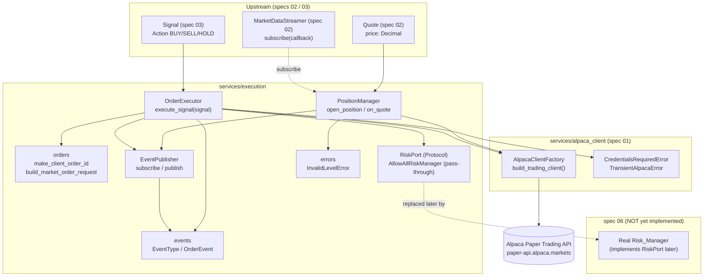
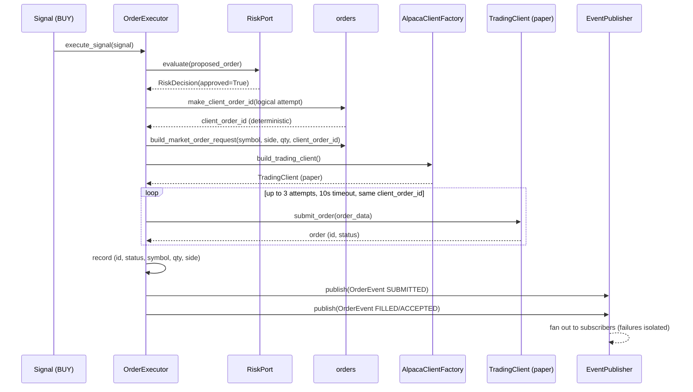
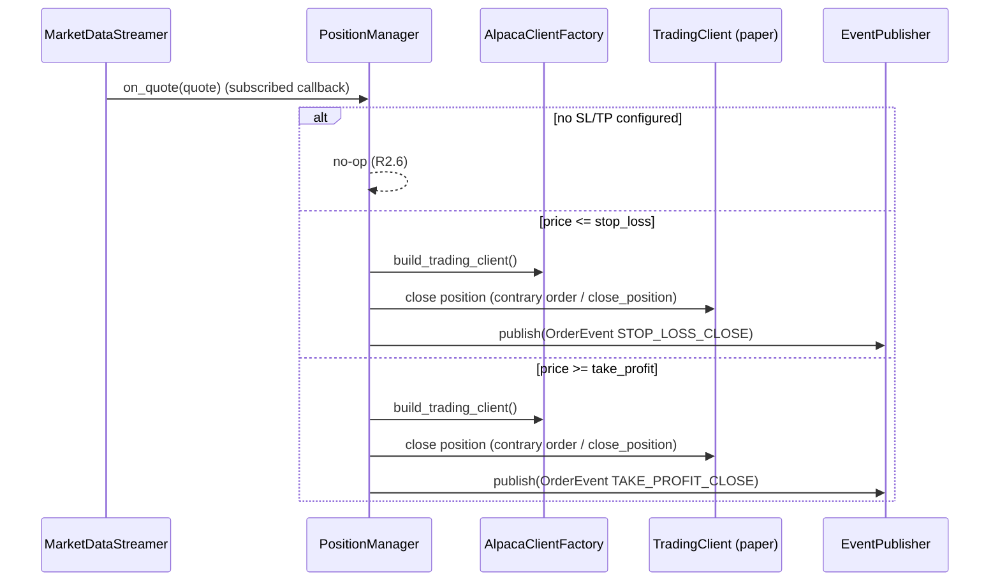

# Design Document

## Overview

This spec implements the **order execution layer** for TradeBot: the component that turns a strategy `Signal` into an order on the Alpaca **paper trading** account (`https://paper-api.alpaca.markets`) for the single asset `BTC/USD`, manages automatic Stop-Loss / Take-Profit closes, guarantees idempotent submission under network retries, and emits domain events describing everything the bot does. It operates **exclusively in paper trading mode**; no real money is ever at risk.

The layer sits downstream of specs `01`, `02`, and `03` and depends on them (and on the not-yet-built spec `06`) through explicit, SDK-independent interfaces:

- The authenticated trading client is obtained **only** through `AlpacaClientFactory.build_trading_client()` (spec `01`), reusing that spec's `CredentialsRequiredError` and `TransientAlpacaError`.
- Live BTC/USD prices arrive as spec-02 `Quote` objects (`Quote.price: Decimal`); the `PositionManager` is fed by the `MarketDataStreamer` pub/sub of spec `02`.
- Risk approval is consulted through a **`RiskPort`** interface. The real Risk Manager is **not implemented yet** — it belongs to spec `06-risk-manager`. This spec defines the port plus a trivial pass-through implementation (`AllowAllRiskManager`) so the pipeline is runnable and testable; spec `06` provides the real implementation.
- Domain events are emitted to an **`EventPublisher`**. This spec only publishes to it; spec `07-bot-api` connects the publisher to the frontend WebSocket.

Scope is intentionally minimal, matching the same bounded criteria as specs `01`, `02`, and `03`: paper only, single asset `BTC/USD`, essential capabilities only.

The design covers the five requirements:

- **R1** Order submission from a Signal (BUY/SELL submit, HOLD no-op, record result, error handling).
- **R2** Stop-Loss / Take-Profit registration, level validation, and quote-driven automatic close.
- **R3** Idempotent submission via a deterministic `Client_Order_Id`, retries (max 3, 10s timeout) with no duplicate order.
- **R4** Domain events on every state change, no secrets, subscriber-failure isolation.
- **R5** Risk approval gate before any submission.

### Fit within the monorepo

Per the structure steering (`04-order-execution → backend/app/services/execution/`), this spec adds one new self-contained domain package. It reuses spec-01 factory/errors and spec-02/03 models; it introduces no new heavy dependencies.

| Existing asset | Role in this feature |
| --- | --- |
| `services/alpaca_client/factory.py` (`AlpacaClientFactory.build_trading_client()`) | Sole source of the authenticated paper trading client (R1.1, R1.2). |
| `services/alpaca_client/errors.py` (`CredentialsRequiredError`, `TransientAlpacaError`) | Reused as-is for missing credentials and timeout/network failures (R1.7, R1.8). |
| `services/data_feed/models.py` (`Quote`) | Live price input to `PositionManager.on_quote` (R2.3). |
| `services/data_feed/streaming.py` (`MarketDataStreamer.subscribe`) | Wiring that feeds quotes to the `PositionManager` (R2.3). |
| `services/strategies/signals.py` (`Signal`, `Action`) | Input consumed by `OrderExecutor.execute_signal` (R1.1, R1.4, R5.1). |

New files introduced:

```
backend/app/services/execution/
  __init__.py     # package exports
  events.py       # EventType(Enum), OrderEvent, EventPublisher (in-memory pub/sub)
  risk.py         # RiskDecision, RiskPort (Protocol), AllowAllRiskManager (pass-through)
  orders.py       # make_client_order_id(...) + build_market_order_request(...)
  executor.py     # OrderExecutor (Signal -> risk gate -> submit -> record -> events)
  positions.py    # PositionManager (SL/TP registration, on_quote, close)
  errors.py       # InvalidLevelError
```

Reused (imported, not duplicated): `AlpacaClientFactory`, `CredentialsRequiredError`, `TransientAlpacaError` (spec 01); `Quote` (spec 02); `Signal`, `Action` (spec 03).

## Architecture

The layer is a thin domain package built around two services: `OrderExecutor` (signal → order) and `PositionManager` (quote → SL/TP close). Both emit through the same `EventPublisher`. The `OrderExecutor` never constructs an Alpaca client directly — it always goes through the factory — and never consults risk logic itself; it delegates to the `RiskPort`.



### Approved BUY flow (sequence)



### Stop-Loss / Take-Profit flow (sequence)



### Key design decisions

- **Risk as a port, with a pass-through default.** `OrderExecutor` depends only on `RiskPort`. `AllowAllRiskManager` lets this spec run/test end to end; spec `06` swaps in the real manager without touching the executor (R5.1, R5.2, R5.3).
- **Factory-only client access.** Neither service constructs Alpaca clients directly; both call `AlpacaClientFactory.build_trading_client()`, inheriting decrypted credentials and the paper-only barrier (R1.1, R1.2).
- **Deterministic idempotency key.** `make_client_order_id` derives the id purely from the logical order attempt, so a retry reuses the same id and Alpaca dedupes at its end; the executor records at most one order per attempt (R3.1, R3.2, R3.3, R3.5).
- **Events on every transition, no secrets.** Both services emit `OrderEvent`s built only from non-sensitive fields; the `EventPublisher` isolates subscriber failures so a bad subscriber never interrupts execution (R4.1, R4.2, R4.3).
- **Decoupled position tracking.** `PositionManager` receives `Quote`s (it does not import the streamer). Wiring subscribes `on_quote` to `MarketDataStreamer`, keeping the position logic pure and unit-testable (R2.3).
- **Stay alive on Alpaca errors.** Non-auth API rejections and transient errors are captured, logged, and turned into events; the process keeps running. Only missing credentials propagate as `CredentialsRequiredError` (R1.6, R1.7, R1.8).

## Components and Interfaces

### Events (`services/execution/events.py`)

```python
from dataclasses import dataclass, field
from datetime import datetime, timezone
from decimal import Decimal
from enum import Enum
from typing import Callable


class EventType(str, Enum):
    """Domain event kinds emitted by the execution layer (R4.1)."""
    SUBMITTED = "SUBMITTED"
    FILLED = "FILLED"
    REJECTED = "REJECTED"
    ERROR = "ERROR"
    RISK_BLOCK = "RISK_BLOCK"
    STOP_LOSS_CLOSE = "STOP_LOSS_CLOSE"
    TAKE_PROFIT_CLOSE = "TAKE_PROFIT_CLOSE"


@dataclass(frozen=True)
class OrderEvent:
    """A structured, secret-free description of an execution state change (R4.1, R4.2)."""
    event_type: EventType
    symbol: str
    side: str | None = None          # "buy" / "sell" (None for pure informational events)
    qty: Decimal | None = None
    price: Decimal | None = None     # present when applicable (fills, SL/TP closes)
    order_id: str | None = None      # Alpaca order id when known
    reason: str = ""                 # human-readable, no secrets
    timestamp: datetime = field(default_factory=lambda: datetime.now(timezone.utc))


EventCallback = Callable[[OrderEvent], None]


class EventPublisher:
    """In-memory pub/sub for domain events (R4.1, R4.3, R4.4).

    Spec 07-bot-api subscribes to this publisher to bridge events to the WebSocket.
    """

    def subscribe(self, callback: EventCallback) -> None:
        """Register a subscriber to receive every published OrderEvent."""

    def unsubscribe(self, callback: EventCallback) -> None: ...

    def publish(self, event: OrderEvent) -> None:
        """Fan out an event to all subscribers. A subscriber that raises is caught
        and logged; remaining subscribers still receive the event and the caller is
        never interrupted (R4.3)."""
```

`publish` iterates over a copy of the subscriber list and wraps each callback in a `try/except`, logging the failure (without secrets) and continuing (R4.3).

### Risk port (`services/execution/risk.py`)

```python
from dataclasses import dataclass
from decimal import Decimal
from typing import Protocol, runtime_checkable


@dataclass(frozen=True)
class ProposedOrder:
    """The order the executor asks the risk layer to approve (R5.1)."""
    symbol: str
    side: str          # "buy" / "sell"
    qty: Decimal


@dataclass(frozen=True)
class RiskDecision:
    """Result of a risk evaluation (R5.2, R5.3)."""
    approved: bool
    reason: str = ""


@runtime_checkable
class RiskPort(Protocol):
    """Interface the executor uses to gate every order (R5.1).

    The real implementation is provided later by spec 06-risk-manager; this spec
    depends only on this port.
    """
    def evaluate(self, proposed_order: ProposedOrder) -> RiskDecision: ...


class AllowAllRiskManager:
    """Trivial pass-through implementation used ONLY so this spec is runnable and
    testable before spec 06 exists. Approves every proposed order (R5.2).

    Spec 06-risk-manager will provide the real RiskPort implementation."""

    def evaluate(self, proposed_order: ProposedOrder) -> RiskDecision:
        return RiskDecision(approved=True, reason="allow-all pass-through")
```

### Orders / idempotency key (`services/execution/orders.py`)

```python
import hashlib
from decimal import Decimal

# Deterministic key derived from the logical order attempt (symbol + side + attempt id).
# The same logical attempt always yields the same id; a retry reuses it (R3.1, R3.2).

def make_client_order_id(symbol: str, side: str, attempt_key: str) -> str:
    """Return a deterministic Client_Order_Id for one Logical_Order_Attempt (R3.1).

    `attempt_key` uniquely identifies the intent (e.g. the signal timestamp/id). The
    function is pure: equal inputs always produce the same id, so retries reuse it
    (R3.2). Implemented as a stable hash to keep the id within Alpaca's length limit.
    """
    raw = f"{symbol}|{side}|{attempt_key}".encode("utf-8")
    return "tb-" + hashlib.sha1(raw).hexdigest()[:24]


def build_market_order_request(symbol: str, side: str, qty: Decimal, client_order_id: str):
    """Build the alpaca-py MarketOrderRequest for a paper order (R1.1, R1.2, R3.1).

    Uses lazy imports of alpaca.* (as in specs 01/02):
        from alpaca.trading.requests import MarketOrderRequest
        from alpaca.trading.enums import OrderSide, TimeInForce
    Maps side "buy"/"sell" -> OrderSide; TimeInForce.GTC; attaches client_order_id.
    """
```

### Order executor (`services/execution/executor.py`)

```python
from decimal import Decimal

from app.services.alpaca_client.factory import AlpacaClientFactory
from app.services.execution.events import EventPublisher, OrderEvent
from app.services.execution.risk import RiskPort
from app.services.strategies.signals import Signal


class OrderExecutor:
    """Turns a Signal into (at most) one paper order, gated by risk, with events (R1, R3, R5)."""

    MAX_ATTEMPTS = 3
    SUBMISSION_TIMEOUT_SECONDS = 10

    def __init__(
        self,
        factory: AlpacaClientFactory,
        risk: RiskPort,
        publisher: EventPublisher,
        symbol: str = "BTC/USD",
        qty: Decimal = Decimal("0.001"),
    ) -> None: ...

    def execute_signal(self, signal: Signal) -> OrderEvent | None:
        """Execute one Signal end to end (R1.1-R1.8, R3, R5).

        Flow:
          - action HOLD           -> submit no order, return None (R1.4)
          - action BUY/SELL       -> ask RiskPort.evaluate(proposed_order) first (R5.1)
              - rejected          -> submit no order; log; publish RISK_BLOCK; return it (R5.3)
              - approved          -> compute deterministic client_order_id (R3.1),
                                     build request, obtain client via factory, submit with
                                     retries (max 3, 10s timeout, same id) (R3.4, R3.5),
                                     record (id, status, symbol, qty, side) (R1.3),
                                     publish SUBMITTED then FILLED/ACCEPTED, return it.

        Error handling:
          - non-auth Alpaca API rejection -> capture, log, publish REJECTED, stay alive (R1.6)
          - timeout/network -> TransientAlpacaError, retry; on exhaustion log "unconfirmed",
            create no extra order, publish ERROR, stay alive (R1.7, R3.4)
          - a retry hitting an already-accepted client_order_id -> treat as the existing
            order, record no second order (R3.3)
          - no credentials -> CredentialsRequiredError propagates, no order (R1.8)
        """
```

Retry logic: a single `attempt_key` (from the signal) yields one `client_order_id` for the whole attempt. Each of the up to 3 tries calls `submit_order` with that same id under the 10s timeout. On a duplicate-id response from Alpaca, the executor reads the existing order rather than creating a new one (R3.3). After 3 unconfirmed tries it logs an "unconfirmed submission" error, publishes `ERROR`, and creates no further orders (R3.4, R3.5).

### Position manager / SL-TP (`services/execution/positions.py`)

```python
from dataclasses import dataclass
from decimal import Decimal

from app.services.alpaca_client.factory import AlpacaClientFactory
from app.services.data_feed.models import Quote
from app.services.execution.events import EventPublisher


class PositionManager:
    """Tracks the open long BTC/USD position and closes it on SL/TP (R2)."""

    def __init__(self, factory: AlpacaClientFactory, publisher: EventPublisher) -> None: ...

    def open_position(
        self,
        symbol: str,
        side: str,
        qty: Decimal,
        entry_price: Decimal,
        stop_loss: Decimal | None = None,
        take_profit: Decimal | None = None,
    ) -> None:
        """Record an open long position with optional SL/TP levels (R2.1).

        Validation (R2.2): a stop_loss >= entry_price, or a take_profit <= entry_price,
        raises InvalidLevelError; no tracking starts for that level and the process
        keeps running. Valid: stop_loss < entry_price < take_profit.
        """

    def on_quote(self, quote: Quote) -> None:
        """Evaluate the latest live price against the open position's levels (R2.3-R2.6).

          - no SL and no TP configured        -> no-op (R2.6)
          - quote.price <= stop_loss           -> close position + publish STOP_LOSS_CLOSE (R2.4)
          - quote.price >= take_profit         -> close position + publish TAKE_PROFIT_CLOSE (R2.5)
          - otherwise                          -> no-op
        Closing uses the factory's TradingClient (contrary order / close_position).
        """
```

Wiring (described, not owned here): the bot lifecycle calls `market_data_streamer.subscribe(position_manager.on_quote)` so each normalized `Quote` reaches `on_quote`. `PositionManager` never imports the streamer, keeping it decoupled and directly unit-testable by calling `on_quote` with constructed `Quote`s (R2.3).

### Errors (`services/execution/errors.py`)

```python
class ExecutionError(Exception):
    """Base for execution-layer domain errors."""


class InvalidLevelError(ExecutionError, ValueError):
    """A Stop-Loss / Take-Profit level is invalid for a long position (R2.2).

    Subclasses ValueError so callers can catch either. Raised when stop_loss >=
    entry_price or take_profit <= entry_price."""
```

Reused from `services/alpaca_client/errors.py`: `CredentialsRequiredError` (R1.8), `TransientAlpacaError` (R1.7).

## Data Models

### OrderEvent (`services/execution/events.py`)

Immutable dataclass, the only event shape any subscriber (including spec 07) sees. Fields: `event_type: EventType`, `symbol: str`, `side: str | None`, `qty: Decimal | None`, `price: Decimal | None`, `order_id: str | None`, `reason: str`, `timestamp: datetime`. It carries **only** non-sensitive data — never API keys, secrets, or raw credential material (R4.2). `EventType` is `str`-backed so spec 07 can serialize it without a custom encoder.

### RiskDecision / ProposedOrder (`services/execution/risk.py`)

- **`ProposedOrder`** — frozen dataclass `(symbol, side, qty)`; the minimal description the executor hands to the risk layer (R5.1).
- **`RiskDecision`** — frozen dataclass `(approved: bool, reason: str)`; the port's answer (R5.2, R5.3).

### Position (`services/execution/positions.py`)

Internal record of the open position:

```python
@dataclass
class Position:
    symbol: str
    side: str
    qty: Decimal
    entry_price: Decimal
    stop_loss: Decimal | None = None
    take_profit: Decimal | None = None
```

Invariant enforced at registration for a long position: `stop_loss < entry_price` (when set) and `take_profit > entry_price` (when set); violations raise `InvalidLevelError` (R2.2). Monetary fields use `Decimal`, consistent with specs 01/02.

## Error Handling

The layer separates **safe conditions** (never crash the bot) from the single **hard-stop** condition (missing credentials). Everything reaches subscribers as an `OrderEvent`; the process stays up.

| Cause | Behavior | Raises? | Event | Req |
| --- | --- | --- | --- | --- |
| Signal action is HOLD | No submission; return `None` | No | none | R1.4 |
| Risk rejects the order | No submission; log rejection | No | `RISK_BLOCK` (with reason) | R5.3 |
| Non-authentication Alpaca API rejection | Capture + log; stay alive | No | `REJECTED` | R1.6 |
| Timeout / network failure | `TransientAlpacaError`; retry (max 3, 10s); stay alive | Handled internally | `ERROR` (after exhaustion) | R1.7, R3.4 |
| Retry hits already-accepted `client_order_id` | Treat as existing order; no 2nd order | No | (no duplicate) | R3.3 |
| No credentials configured | Surface error; no submission | Yes (`CredentialsRequiredError`) | none | R1.8 |
| Invalid SL/TP level at registration | Reject that level; keep running | Yes (`InvalidLevelError`/`ValueError`) | none | R2.2 |
| Event subscriber raises | Catch + log; continue execution | No | (others still delivered) | R4.3 |

Handling rules:

- **Stay alive.** Non-auth rejections and transient failures are turned into events and logged; the bot process is never terminated by them (R1.6, R1.7).
- **One hard stop.** Only `CredentialsRequiredError` propagates to the caller and blocks submission (R1.8).
- **Validate levels before tracking.** `open_position` validates SL/TP before recording; an invalid level raises without starting any tracking (R2.2).
- **Subscriber isolation.** `EventPublisher.publish` never lets a subscriber exception escape (R4.3).

### HTTP / WebSocket mapping (owned by spec 07, mentioned for context)

This spec exposes no HTTP or WebSocket surface. Spec `07-bot-api` subscribes to the `EventPublisher` and maps each `OrderEvent` onto the frontend WebSocket, and maps `CredentialsRequiredError` / `TransientAlpacaError` to HTTP responses. The concrete codes and payloads are defined by spec 07, not here.

## Correctness Properties

*A property is a characteristic or behavior that should hold true across all valid executions of a system—essentially, a formal statement about what the system should do. Properties serve as the bridge between human-readable specifications and machine-verifiable correctness guarantees.*

Property-based testing **is appropriate** for this layer: the executor's decision logic (HOLD gate, risk gate), the idempotency-key function, the SL/TP evaluation, and subscriber fan-out are deterministic behaviors with clear input/output over a large input space, and the Alpaca `TradingClient` is mocked so 100+ iterations stay fast and network-free. Infrastructure concerns (actual WebSocket delivery, real Alpaca behavior) are out of scope and belong to spec 07. Properties are intentionally kept to the essentials (~7). Each is written for property-based testing (minimum 100 iterations).

### Property 1: Approved BUY/SELL submits exactly one order and records it

*For any* BUY or SELL `Signal` that the `RiskPort` approves, `execute_signal` calls `RiskPort.evaluate` before submitting, submits exactly one order through the factory's `TradingClient` with the matching side, `symbol`, and `qty`, and records/emits a result carrying the order id, status, symbol, qty, and side.

**Validates: Requirements 1.1, 1.2, 1.3, 5.1, 5.2**

### Property 2: HOLD never submits an order

*For any* `Signal` whose action is `HOLD`, `execute_signal` submits no order (the mocked `TradingClient.submit_order` is never called) and returns `None`.

**Validates: Requirements 1.4**

### Property 3: A risk-rejected signal never submits and emits RISK_BLOCK

*For any* BUY or SELL `Signal` that the `RiskPort` rejects, `execute_signal` submits no order and publishes exactly one `RISK_BLOCK` `OrderEvent` carrying the rejection reason.

**Validates: Requirements 1.5, 5.1, 5.3**

### Property 4: Deterministic id and idempotent retries create no duplicate order

*For any* logical order attempt (symbol, side, attempt key), `make_client_order_id` is deterministic (equal inputs yield an equal id); and *for any* number of transient failures within a single attempt, every retry reuses that same `client_order_id`, no more than 3 attempts are made, and at most one logical Alpaca order is recorded.

**Validates: Requirements 3.1, 3.2, 3.4, 3.5**

### Property 5: SL/TP thresholds close the position with the correct event, and no levels means no close

*For any* open long position with configured levels: a quote price `<= stop_loss` closes the position and emits `STOP_LOSS_CLOSE`, and a quote price `>= take_profit` closes the position and emits `TAKE_PROFIT_CLOSE`; *for any* open position with neither level configured, no quote triggers a close.

**Validates: Requirements 2.3, 2.4, 2.5, 2.6**

### Property 6: A failing subscriber never interrupts execution

*For any* set of `EventPublisher` subscribers in which at least one raises, `publish` still delivers the event to the remaining subscribers, logs the failure, and returns normally so order execution continues uninterrupted.

**Validates: Requirements 4.3**

### Property 7: No emitted event contains secrets or credentials

*For any* `OrderEvent` produced by the layer, its fields contain no API key, secret, or credential material.

**Validates: Requirements 4.2**

## Testing Strategy

Property-based testing **is appropriate** for the deterministic decision logic, the idempotency key, SL/TP evaluation, and subscriber fan-out; the Alpaca SDK is mocked so tests are fast and network-free. Level-validation and the invalid-level rule are also property-tested. Alpaca-error paths (non-auth rejection, transient timeout, missing credentials) and the duplicate-id response are covered by focused example/edge tests, aligned with the Minimum Tests in the requirements.

### Tooling

- **Framework:** `pytest` (configured in `backend/pyproject.toml` / `backend/tests/`).
- **Property-based library:** [Hypothesis](https://hypothesis.readthedocs.io/) — do not hand-roll property testing. Generators build random `Signal`s (action, reason, timestamp), random `Quote` prices, and random SL/TP levels.
- **Mocking:** the `alpaca` package is stubbed via `sys.modules` (as in specs 01/02) so `MarketOrderRequest`, `OrderSide`, `TimeInForce`, and `TradingClient.submit_order` are fakes; `AlpacaClientFactory.build_trading_client` is patched to return the fake client. No real network calls.
- **Ports are trivial to fake:** `RiskPort` is stubbed with approve/reject stubs and a call-order spy; `EventPublisher` is real (in-memory) and its emitted events are inspected directly.

### Property tests (min. 100 iterations each)

Each test carries a comment tag: **Feature: 04-order-execution, Property {n}: {property text}**. Property tests live close to the code they cover.

| Property | Focus | Notes |
| --- | --- | --- |
| P1 | Approved BUY/SELL submits + records | Approving `RiskPort`; assert `evaluate` precedes one `submit_order` with correct side/symbol/qty; result records id/status/symbol/qty/side. |
| P2 | HOLD never submits | Generate HOLD signals; assert `submit_order` never called, returns `None`. |
| P3 | Risk reject → no order + `RISK_BLOCK` | Rejecting `RiskPort`; assert no `submit_order`, one `RISK_BLOCK` with reason. |
| P4 | Deterministic id + idempotent retries | Equal inputs → equal id; simulate N transient failures, assert ≤3 attempts, single id, one recorded order. |
| P5 | SL/TP close + no-levels no-op | Generate levels + quote price ≤ SL / ≥ TP → correct close event; no levels → never closes. |
| P6 | Subscriber failure isolation | Random subscriber set with one raising; assert others invoked and `publish` returns. |
| P7 | Events carry no secrets | Inspect every produced `OrderEvent`; assert no credential substrings present. |

### Unit / example tests (Minimum Tests + edges)

- **Approved BUY/SELL submission (Minimum Test):** covered by P1, plus one concrete example asserting `submit_order` args.
- **Risk rejection blocks order (Minimum Test):** covered by P3, plus a concrete example.
- **HOLD blocks order (Minimum Test):** covered by P2, plus a concrete example.
- **Alpaca rejection stays alive (Minimum Test):** mock `submit_order` to raise a non-auth error → `REJECTED` event emitted, no exception escapes (R1.6).
- **Transient failure (R1.7):** mock timeout/network → `TransientAlpacaError` handled, retried, `ERROR` event after exhaustion, process alive.
- **No credentials (Minimum Test):** factory raises `CredentialsRequiredError` → propagates, `submit_order` never called (R1.8).
- **Idempotent retry (Minimum Test):** covered by P4, plus an edge test where the second call returns an already-accepted order → exactly one recorded order (R3.3).
- **Stop-Loss / Take-Profit trigger (Minimum Test):** covered by P5, plus concrete examples for a SL hit and a TP hit.
- **Invalid SL/TP level (R2.2):** `stop_loss >= entry_price` or `take_profit <= entry_price` → `InvalidLevelError`, no tracking, process alive.
- **Level recording (R2.1):** `open_position` with valid levels → levels stored.
- **Resilient subscribers (Minimum Test):** covered by P6, plus a concrete two-subscriber example (one raises).
- **Event fields (R4.1):** trigger each transition → event carries type/symbol/side/qty/reason (price when applicable).

### Requirements-to-minimum-tests mapping

| Minimum test (requirements.md) | Covered by |
| --- | --- |
| Approved BUY/SELL submission | P1 + example |
| Risk rejection blocks order | P3 + example |
| HOLD blocks order | P2 + example |
| Alpaca rejection stays alive | Non-auth rejection example (R1.6) |
| Stop-Loss / Take-Profit trigger | P5 + examples |
| Idempotent retry | P4 + duplicate-id edge test |
| Resilient subscribers | P6 + example |
| No credentials | `CredentialsRequiredError` example (R1.8) |

### Requirements traceability summary

| Requirement | Components | Tests |
| --- | --- | --- |
| R1 (order submission) | `OrderExecutor`, `orders.build_market_order_request`, `AlpacaClientFactory`, `errors` | P1, P2; R1.6/R1.7/R1.8 examples |
| R2 (SL/TP) | `PositionManager`, `Position`, `InvalidLevelError`, `Quote` | P5; R2.1/R2.2 examples |
| R3 (idempotency) | `orders.make_client_order_id`, `OrderExecutor` retry logic | P4; duplicate-id edge |
| R4 (domain events) | `EventPublisher`, `OrderEvent`, `EventType` | P6, P7; R4.1 example |
| R5 (risk gate) | `RiskPort`, `AllowAllRiskManager`, `ProposedOrder`, `RiskDecision`, `OrderExecutor` | P1, P3 |
