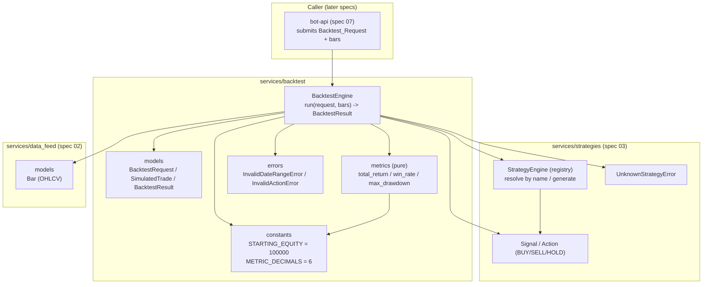

# Design Document

## Overview

This spec implements the **backtest engine** for TradeBot: the component that simulates a trading strategy over historical BTC/USD data to estimate its performance before it is run live (even in paper trading). It replays an already-fetched, chronologically ordered sequence of historical bars, applies the strategy to each bar exactly once, simulates the resulting trades **entirely in memory**, and reports summary performance metrics at the end of the run.

The engine sits downstream of specs `02` and `03` and depends on them through explicit, SDK-independent interfaces. Critically, it performs **no Alpaca calls at any point during a run** (R1.5):

- It reuses the exact spec-03 `Strategy` interface and `Signal`/`Action` types without modification, so behavior observed in a backtest is directly comparable to live behavior (R3.1, R3.2).
- It resolves the strategy by name through the **same spec-03 `StrategyEngine`/registry** that live operation uses (R3.3), reusing spec-03 `UnknownStrategyError` for unregistered names (R1.7).
- It consumes historical market data in the single spec-02 normalization format — a `Bar` composed exactly of timestamp, open, high, low, close, volume. The engine receives the ordered `Bar` sequence as an input argument and never fetches it itself.

Scope is intentionally minimal, matching the same bounded criteria as specs `01`–`04`: paper trading only, single asset `BTC/USD`, no Alpaca interaction during a backtest, essential capabilities only. This spec exposes no HTTP surface — that belongs to spec `07-bot-api`.

The design covers the four requirements:

- **R1** Replay bars in ascending order, one Signal per bar; BUY/SELL → in-memory `Simulated_Trade`, HOLD → none; no Alpaca calls; empty sequence → completed run with zero trades / zero return; unregistered name, invalid date range, and out-of-range action each raise and return no result.
- **R2** Report exactly four metrics (`Total_Return`, `Trade_Count`, `Win_Rate`, `Max_Drawdown`) computed from a fixed `Starting_Equity` of `100000`, in valid ranges, rounded to 6 decimals, with the zero-trade degenerate case pinned to zeros.
- **R3** Apply strategies exclusively through the unaltered spec-03 interface and resolve them through the same spec-03 registry used live.
- **R4** Reproducibility: same bars + strategy + seed → field-by-field equal `Backtest_Result`; deterministic strategy → equal result regardless of seed; identical request → identical result on every run.

### Fit within the monorepo

Per the structure steering (`05-backtest-engine → backend/app/services/backtest/`), this spec adds one new self-contained domain package. It reuses spec-02 models and the spec-03 registry/interface/errors; it introduces no new heavy dependencies and no I/O — the money math is hand-rolled over `Decimal` (consistent with specs 01/02), so pandas/numpy are not required.

| Existing asset | Role in this feature |
| --- | --- |
| `app/services/data_feed/models.py` (`Bar`) | Sole historical market-data format replayed during a run; imported as `from app.services.data_feed.models import Bar`. No Alpaca types cross this boundary (R1.2, R3.1). |
| `app/services/strategies/base.py` (`Strategy`) | The unaltered plug-and-play interface every backtested strategy conforms to (R3.1, R3.2). |
| `app/services/strategies/signals.py` (`Signal`, `Action`) | The Signal/Action output interpreted per bar; BUY/SELL → trade, HOLD → none (R1.2, R1.4, R3.2). |
| `app/services/strategies/registry.py` (`StrategyEngine`) | The same registry used live; the engine resolves strategy-by-name through it (R3.3). |
| `app/services/strategies/errors.py` (`UnknownStrategyError`) | Reused as-is for an unregistered strategy name (R1.7). |
| `app/services/` | Location of the new `services/backtest/` domain package. |

New files introduced:

```
backend/app/services/backtest/
  __init__.py     # package exports (BacktestRequest, SimulatedTrade, BacktestResult, BacktestEngine, errors, constants)
  constants.py    # STARTING_EQUITY = Decimal("100000"); METRIC_DECIMALS = 6
  models.py       # BacktestRequest, SimulatedTrade, BacktestResult dataclasses
  metrics.py      # pure functions: total_return(), win_rate(), max_drawdown()
  engine.py       # BacktestEngine.run(request, bars) -> BacktestResult
  errors.py       # BacktestError, InvalidDateRangeError, InvalidActionError
```

Reused (imported, not duplicated): `Bar` (spec 02); `Strategy`, `Signal`, `Action` (spec 03); `StrategyEngine`, `UnknownStrategyError` (spec 03). The engine defines no new Alpaca client and imports no `alpaca.*` module.

## Architecture

The backtest engine is a thin, pure domain layer with no external I/O. `BacktestEngine.run` receives a `BacktestRequest` and an ordered `Bar` sequence, validates the request, resolves the strategy through the spec-03 `StrategyEngine`, replays the bars one at a time, simulates trades in memory, then delegates to the pure `metrics` functions to produce a `BacktestResult`. The engine consumes the spec-02 `Bar` and the spec-03 registry/`Signal`; it never constructs an Alpaca client.



### Backtest run (sequence)

```mermaid
sequenceDiagram
    participant C as Caller
    participant EN as BacktestEngine
    participant SE as StrategyEngine (spec 03)
    participant ST as Strategy
    participant MT as metrics

    C->>EN: run(request, bars)
    EN->>EN: validate date range (start <= end) — else InvalidDateRangeError (R1.8)
    EN->>SE: resolve strategy by request.strategy_name
    alt name not registered
        SE-->>EN: raise UnknownStrategyError (R1.7)
        EN-->>C: propagate; no bars replayed, no result
    else resolved
        SE-->>EN: Strategy instance (seeded if request.seed set, R4.2)
        Note over EN: equity = STARTING_EQUITY (100000, R2.2)
        loop for each bar in ascending timestamp order (R1.1)
            EN->>ST: generate(bars_up_to_and_including_this_bar)
            ST-->>EN: Signal (action)
            alt action not in {BUY, SELL, HOLD}
                EN-->>C: raise InvalidActionError; stop replay, no result (R1.9)
            else BUY or SELL
                EN->>EN: record SimulatedTrade in memory (no Alpaca, R1.3, R1.5)
            else HOLD
                EN->>EN: record no trade (R1.4)
            end
        end
        EN->>MT: total_return / win_rate / max_drawdown over equity curve
        MT-->>EN: metrics (rounded to 6 dp, R2.6)
        EN-->>C: BacktestResult(metrics + trades) (R2.1)
    end
```

### Key design decisions

- **Pure, in-memory simulation, zero network.** `run` takes the `Bar` sequence as an argument and never fetches or submits anything; no `alpaca.*` import exists in the package. This guarantees "no Alpaca calls during a run" structurally, not just by convention (R1.3, R1.5).
- **Reuse the live strategy path unchanged.** Strategies are resolved through the same spec-03 `StrategyEngine`/registry and invoked through the unaltered `Strategy.generate` interface, with no adapter that could change an action. A `BUY`/`SELL` becomes a trade and a `HOLD` becomes nothing — the same observable rule as live (R3.1, R3.2, R3.3).
- **Ascending replay, one Signal per bar.** The engine sorts/asserts bars into strictly ascending timestamp order and calls the strategy exactly once per bar, feeding the strategy the history up to and including the current bar so indicator-based strategies behave as they would live (R1.1).
- **Fixed, shared starting equity.** Every run starts from the `STARTING_EQUITY` constant (`Decimal("100000")`), applied identically across all runs, so results are comparable (R2.2).
- **Metrics are pure functions.** `total_return`, `win_rate`, and `max_drawdown` are side-effect-free functions of the trade list / equity curve, making them trivially property-testable and keeping `BacktestEngine` thin (R2.1, R2.3, R2.4, R2.5).
- **Deterministic by construction; seed only feeds strategy randomness.** The engine adds no randomness of its own. Given the same bars and the same (seeded) strategy, replay and metrics are deterministic field by field. The optional `seed` is used solely to initialize strategy randomness before replay; a deterministic strategy ignores it (R4.1, R4.2, R4.3, R4.4).
- **Fail-loud for bad requests, before any replay.** Invalid date range (`InvalidDateRangeError`), unregistered name (`UnknownStrategyError`), and out-of-range action (`InvalidActionError`) all abort the run and return no `Backtest_Result`; the first two check before replay begins, the last stops replay immediately (R1.7, R1.8, R1.9).
- **Degenerate cases pinned to zero.** An empty bar sequence, or any run with `Trade_Count == 0`, yields a completed `Backtest_Result` with `Total_Return`, `Win_Rate`, and `Max_Drawdown` all zero (R1.6, R2.7).

## Components and Interfaces

### Constants (`services/backtest/constants.py`)

```python
from decimal import Decimal

# Fixed positive equity every run starts from, applied identically across all runs (R2.2).
STARTING_EQUITY: Decimal = Decimal("100000")

# Total_Return, Win_Rate, and Max_Drawdown are reported rounded to this many decimals (R2.6).
METRIC_DECIMALS: int = 6
```

### Request / config model (`services/backtest/models.py`)

```python
from dataclasses import dataclass
from datetime import datetime
from decimal import Decimal


@dataclass(frozen=True)
class BacktestRequest:
    """Input to a backtest run (R1.1).

    The Bar_Sequence itself is passed separately to BacktestEngine.run(); this model
    carries only the run configuration. strategy_name is resolved through the spec-03
    registry (R3.3). start/end bound the Date_Range inclusively; start > end is invalid
    (R1.8). seed, when present, initializes strategy randomness before replay (R4.2);
    when absent, a randomized strategy still runs but is not guaranteed reproducible
    (R4.5).
    """

    strategy_name: str          # resolved through the spec-03 StrategyEngine/registry
    symbol: str = "BTC/USD"     # single asset in this phase
    timeframe: str = "1Min"     # one of 1Min / 5Min / 15Min / 1Hour / 1Day (spec 02)
    start: datetime | None = None   # inclusive Date_Range start (UTC)
    end: datetime | None = None     # inclusive Date_Range end (UTC)
    seed: int | None = None         # optional Seed for strategy randomness (R4.2)
```

### Simulated trade (`services/backtest/models.py`)

```python
@dataclass(frozen=True)
class SimulatedTrade:
    """An in-memory entry or exit derived from a Signal during replay (R1.3).

    Never reaches Alpaca. `side` is "buy" or "sell"; `price` is the bar close at which
    the trade is simulated; `timestamp` is the bar's timestamp; `realized_profit` is set
    only on the closing exit of a completed round trip (None on the opening entry).
    """

    side: str                       # "buy" / "sell"
    qty: Decimal
    price: Decimal                  # simulated fill price (bar close)
    timestamp: datetime
    reason: str = ""                # carried from the Signal for transparency
    realized_profit: Decimal | None = None   # set on the closing exit of a round trip
```

### Result (`services/backtest/models.py`)

```python
@dataclass(frozen=True)
class BacktestResult:
    """Output of a completed backtest run (R2.1).

    Reports exactly the four metrics plus the ordered list of Simulated_Trade. Metric
    fractions are rounded to METRIC_DECIMALS (R2.6). total_return >= -1 (R2.3); win_rate
    and max_drawdown are in [0, 1] (R2.4, R2.5). When trade_count == 0, total_return,
    win_rate, and max_drawdown are all zero (R1.6, R2.7).
    """

    total_return: Decimal           # (end_equity - start_equity) / start_equity, >= -1 (R2.3)
    trade_count: int                # completed round-trip trades (R2.1)
    win_rate: Decimal               # fraction of profitable round trips, in [0, 1] (R2.4)
    max_drawdown: Decimal           # largest peak-to-trough decline / peak, in [0, 1] (R2.5)
    trades: list[SimulatedTrade]    # ordered sequence of simulated trades (R2.1)
```

### Metrics (`services/backtest/metrics.py`)

Pure, deterministic functions over the equity curve / completed trades. No SDK, no global state; all money is `Decimal`.

```python
from decimal import Decimal
from typing import Sequence

from app.services.backtest.constants import STARTING_EQUITY


def total_return(start_equity: Decimal, end_equity: Decimal) -> Decimal:
    """Relative change of equity, rounded to 6 dp (R2.3, R2.6).

    Returns (end_equity - start_equity) / start_equity. With the fixed positive
    STARTING_EQUITY and simulated equity that can fall to zero but not below, the
    result is always >= -1. Precondition: start_equity > 0.
    """


def win_rate(realized_profits: Sequence[Decimal]) -> Decimal:
    """Fraction of completed round trips with profit strictly > 0, rounded to 6 dp
    (R2.4, R2.6).

    Returns count(p for p in realized_profits if p > 0) / len(realized_profits),
    yielding a value in [0, 1]. Returns Decimal("0") when the sequence is empty
    (Trade_Count == 0, R2.7).
    """


def max_drawdown(equity_curve: Sequence[Decimal]) -> Decimal:
    """Largest peak-to-trough decline over the curve / the peak, rounded to 6 dp
    (R2.5, R2.6).

    Tracks the running peak; for each point computes (peak - value) / peak and returns
    the maximum, yielding a value in [0, 1]. Returns Decimal("0") when equity never
    declines from a prior peak or when the curve is empty (R2.5, R2.7).
    """
```

### Backtest engine (`services/backtest/engine.py`)

```python
from decimal import Decimal
from typing import Sequence

from app.services.backtest.models import BacktestRequest, BacktestResult
from app.services.data_feed.models import Bar
from app.services.strategies.registry import StrategyEngine
from app.services.strategies.signals import Action


class BacktestEngine:
    """Replays historical bars through a spec-03 strategy and reports metrics (R1, R2, R3, R4).

    The engine performs no Alpaca calls and no I/O; it operates only on the bars passed
    to run(). It resolves strategies through the SAME spec-03 StrategyEngine used live
    (R3.3) and invokes them through the unaltered Strategy interface (R3.1).
    """

    def __init__(self, strategy_engine: StrategyEngine, qty: Decimal = Decimal("0.001")) -> None:
        """Wire the engine to the shared spec-03 StrategyEngine (registry). `qty` is the
        fixed position size used for each simulated trade."""

    def run(self, request: BacktestRequest, bars: Sequence[Bar]) -> BacktestResult:
        """Run one backtest end to end and return a BacktestResult (R1.1-R1.9, R2, R4).

        Flow:
          1. Validate the Date_Range: if request.start and request.end are both set and
             request.start > request.end -> raise InvalidDateRangeError; replay no bar,
             return no result (R1.8).
          2. Resolve the strategy by request.strategy_name through the spec-03
             StrategyEngine. An unregistered name -> UnknownStrategyError propagates;
             replay no bar, return no result (R1.7, R3.3). If request.seed is set,
             initialize the resolved strategy's randomness with it before replay (R4.2).
          3. Empty bars -> complete immediately: BacktestResult(total_return=0,
             trade_count=0, win_rate=0, max_drawdown=0, trades=[]) (R1.6).
          4. Sort bars into strictly ascending timestamp order and replay them, calling
             the strategy exactly once per bar with the history up to and including that
             bar, evaluating exactly one Signal per bar (R1.1).
               - Signal.action not in {BUY, SELL, HOLD} -> raise InvalidActionError,
                 stop the replay, return no result (R1.9).
               - BUY or SELL -> record a SimulatedTrade in memory; update simulated
                 equity; no Alpaca call (R1.3, R1.5).
               - HOLD -> record no trade for that step (R1.4).
          5. Compute total_return, win_rate, and max_drawdown over the equity curve /
             completed round trips, each rounded to 6 dp (R2.1-R2.6). When trade_count
             is zero, all three are zero (R2.7).
          6. Return BacktestResult with the four metrics and the ordered trades (R2.1).
        """
```

The engine adds no randomness of its own, so two runs with the same `bars`, same resolved strategy, and same `seed` produce byte-identical trade sequences and metrics (R4.1, R4.4); a deterministic strategy makes the seed irrelevant (R4.3).

### Errors (`services/backtest/errors.py`)

```python
class BacktestError(Exception):
    """Base for backtest-engine domain errors."""


class InvalidDateRangeError(BacktestError, ValueError):
    """The Date_Range start timestamp is later than its end timestamp (R1.8).

    Raised before any bar is replayed; the run returns no Backtest_Result."""


class InvalidActionError(BacktestError, ValueError):
    """A Strategy returned a Signal whose action is not exactly one of BUY/SELL/HOLD
    during replay (R1.9).

    Raised mid-replay; the replay stops and the run returns no Backtest_Result."""
```

Reused from `services/strategies/errors.py`: `UnknownStrategyError`, raised when `strategy_name` is not registered in the spec-03 registry (R1.7).

## Data Models

### BacktestRequest (`services/backtest/models.py`)

Frozen dataclass carrying the run configuration only: `strategy_name` (resolved through the spec-03 registry, R3.3), `symbol` (`"BTC/USD"`), `timeframe` (one of the spec-02 timeframes), `start` / `end` (inclusive `Date_Range`, timezone-aware UTC; `start > end` is invalid, R1.8), and an optional `seed` for strategy randomness (R4.2, R4.5). The `Bar` sequence is not stored on the request — it is passed as a separate argument to `run`, keeping the engine free of any fetch responsibility (R1.5).

### SimulatedTrade (`services/backtest/models.py`)

Frozen dataclass describing one in-memory entry or exit derived from a Signal (R1.3): `side` (`"buy"`/`"sell"`), `qty: Decimal`, `price: Decimal` (the simulated fill, taken from the bar close), `timestamp: datetime` (the bar's timestamp), `reason: str` (carried from the Signal), and `realized_profit: Decimal | None` (set only on the closing exit of a completed round trip; `None` on the opening entry). It never reaches Alpaca.

### BacktestResult (`services/backtest/models.py`)

Frozen dataclass reporting **exactly** the four metrics plus the ordered trade list (R2.1):

- `total_return: Decimal` — `(end_equity - start_equity) / start_equity`, always `>= -1` (R2.3).
- `trade_count: int` — number of completed round-trip trades (R2.1).
- `win_rate: Decimal` — fraction of round trips with realized profit `> 0`, in the inclusive range `[0, 1]` (R2.4).
- `max_drawdown: Decimal` — largest peak-to-trough decline / peak, in `[0, 1]`, zero when equity never declines from a prior peak (R2.5).

`Total_Return`, `Win_Rate`, and `Max_Drawdown` are rounded to 6 decimal places (R2.6). When `trade_count == 0` (including the empty-bar case), all three fractions are `Decimal("0")` (R1.6, R2.7).

### Starting equity and money precision

Every run initializes simulated equity to the module constant `STARTING_EQUITY = Decimal("100000")`, a fixed positive value applied identically across all runs (R2.2). All monetary quantities (equity, prices, quantities, realized profit) use `Decimal`, consistent with specs 01/02, to preserve precision and keep metric rounding exact.

## Correctness Properties

*A property is a characteristic or behavior that should hold true across all valid executions of a system—essentially, a formal statement about what the system should do. Properties serve as the bridge between human-readable specifications and machine-verifiable correctness guarantees.*

This layer is well suited to property-based testing: the backtest is a pure, deterministic simulation over generated `Bar` sequences with no network and no Alpaca interaction, and the metrics are pure functions over the equity curve / completed trades. This gives a large, structured input space where 100+ iterations are fast and reveal edge cases (empty/short/degenerate sequences, extreme prices, zero-trade runs). These properties are intentionally kept to the essentials, and each is written for property-based testing (minimum 100 iterations).

### Property 1: Every completed run returns a valid Backtest_Result with in-range metrics

*For any* registered strategy and *for any* ordered `Bar` sequence, a completed `run` returns a `BacktestResult` whose `total_return >= -1`, whose `win_rate` lies in the closed range `[0, 1]`, whose `max_drawdown` lies in the closed range `[0, 1]`, and whose `trade_count >= 0`.

**Validates: Requirements 2.1, 2.3, 2.4, 2.5**

### Property 2: Signal-to-trade correspondence during replay, with no Alpaca calls

*For any* ordered `Bar` sequence and a strategy scripted to return a known action per bar, `run` invokes the strategy exactly once per bar in strictly ascending timestamp order, records a `SimulatedTrade` for exactly the `BUY`/`SELL` steps and none for the `HOLD` steps, and performs no Alpaca call at any point.

**Validates: Requirements 1.1, 1.3, 1.4, 1.5, 3.2**

### Property 3: Metrics are computed correctly and rounded to 6 decimals

*For any* constructed dataset — a start equity, an ending equity, an equity curve, and a list of realized profits — `total_return`, `win_rate`, and `max_drawdown` equal their defining formulas, each rounded to 6 decimal places; and *for any* run yielding zero completed trades (including a `HOLD`-only strategy), `total_return`, `win_rate`, and `max_drawdown` are all zero.

**Validates: Requirements 2.3, 2.4, 2.5, 2.6, 2.7**

### Property 4: An empty bar sequence completes with zero trades and zero return

*For any* `BacktestRequest` with a valid registered strategy replayed over an empty `Bar` sequence, `run` completes without error and returns a `BacktestResult` with `trade_count == 0` and `total_return == 0`.

**Validates: Requirements 1.6**

### Property 5: Reproducibility of results

*For any* fixed `Bar` sequence, registered strategy, and `seed`, two independent `run` invocations produce `BacktestResult` values that are equal field by field, including identical metric values and an identical ordered sequence of `SimulatedTrade`; and *for any* deterministic strategy, the `BacktestResult` is equal field by field regardless of the `seed` provided (including no seed).

**Validates: Requirements 4.1, 4.3, 4.4**

### Property 6: Invalid request or out-of-range action raises and returns no result

*For any* `BacktestRequest` whose `Date_Range` start is later than its end, `run` raises `InvalidDateRangeError` and replays no bar; *for any* `strategy_name` not registered in the spec-03 registry, `run` raises `UnknownStrategyError` and replays no bar; and *for any* strategy that returns an action not in `{BUY, SELL, HOLD}` at some replay step, `run` raises `InvalidActionError` and stops the replay. In every case no `BacktestResult` is returned.

**Validates: Requirements 1.7, 1.8, 1.9**

## Error Handling

The engine separates the **degenerate-but-valid case** (empty bars → a completed run with zeros) from **hard-stop error conditions** (bad request or bad action → raise, no result). No error is ever swallowed into a partial result; a run either returns a complete `BacktestResult` or raises.

| Cause | Handling | Raises? | Req |
| --- | --- | --- | --- |
| Empty `Bar` sequence | Complete the run; return `BacktestResult` with `trade_count=0`, `total_return=0`, `win_rate=0`, `max_drawdown=0` | No | R1.6, R2.7 |
| `Trade_Count == 0` (e.g. HOLD-only) | Report `Total_Return`, `Win_Rate`, `Max_Drawdown` all zero | No | R2.7 |
| `Date_Range` start later than end | Validate before replay; abort with no result | Yes (`InvalidDateRangeError`) | R1.8 |
| `strategy_name` not registered in spec-03 registry | Resolve before replay; abort with no result | Yes (`UnknownStrategyError`, reused) | R1.7 |
| Strategy returns action not in `{BUY, SELL, HOLD}` | Stop replay immediately; abort with no result | Yes (`InvalidActionError`) | R1.9 |

Handling rules:

- **Validate before replay.** The date-range check and the strategy resolution both happen before any bar is replayed, so an invalid request never touches the strategy and never produces a partial result (R1.7, R1.8).
- **Stop-and-raise on a bad action.** If a strategy emits an out-of-range action mid-replay, the engine stops immediately and raises `InvalidActionError`; no metrics are computed and no `BacktestResult` is returned (R1.9).
- **Degenerate ≠ error.** An empty sequence and a zero-trade run are valid outcomes, not errors; they return a well-formed `BacktestResult` pinned to zeros (R1.6, R2.7).
- **No side effects on failure.** Because the engine holds no external resources and performs no I/O, raising leaves no partial state and no Alpaca interaction (R1.5).

### HTTP mapping (owned by spec 07, mentioned for context)

This spec exposes **no HTTP surface**. When spec `07-bot-api` wraps the engine, it will map `InvalidDateRangeError` and `InvalidActionError` to a client error (e.g. `400 Bad Request`) and `UnknownStrategyError` to `400`/`404`, and serialize the `BacktestResult` for the frontend. The concrete status codes and payloads are defined by spec 07, not here.

## Testing Strategy

Property-based testing **is appropriate**: the backtest is deterministic, pure logic over a large space of generated `Bar` sequences, with no external I/O and no network — this spec never touches Alpaca, so **no mocks are needed**. Metrics are pure functions, ideal for property tests. Error paths and the specific known-dataset metrics are covered by focused example tests, aligned with the Minimum Tests in the requirements.

### Tooling

- **Framework:** `pytest` (configured in `backend/pyproject.toml` / `backend/tests/`).
- **Property-based library:** [Hypothesis](https://hypothesis.readthedocs.io/) — do not hand-roll property testing. Generators build random `Bar` sequences (varying length, including empty and single-bar; strictly increasing timestamps; positive `Decimal` OHLCV), random equity curves and realized-profit lists for the metric functions, and random seeds.
- **No mocks needed for Alpaca:** the engine performs no Alpaca calls, so tests construct `Bar`s directly (spec-02 models) and register real strategies in a spec-03 `StrategyEngine`. Scripted strategies (a small stub conforming to the `Strategy` interface that emits a predetermined action per bar) drive the signal-to-trade and error-path tests. A spy over the strategy verifies call count/order.

### Property tests (min. 100 iterations each)

Each test carries a comment tag: **Feature: 05-backtest-engine, Property {n}: {property text}**. Property tests live close to the code they cover.

| Property | Focus | Notes |
| --- | --- | --- |
| P1 | Valid result with in-range metrics | Random bars + registered strategy; assert `total_return >= -1`, `win_rate ∈ [0,1]`, `max_drawdown ∈ [0,1]`, `trade_count >= 0`. |
| P2 | Signal-to-trade correspondence, no Alpaca | Scripted strategy with known action per bar + spy; assert one call per bar in ascending order, trades match BUY/SELL steps, HOLD → none, and no `alpaca.*` access occurs. |
| P3 | Metrics correct + rounded, zero-trade → zeros | Random start/end, equity curves, profit lists → assert formulas hold and are rounded to 6 dp; HOLD-only/zero-trade runs → three metrics zero. |
| P4 | Empty bars → zeros | Empty sequence + registered strategy; assert `trade_count == 0`, `total_return == 0`, no error. |
| P5 | Reproducibility | Same bars+strategy+seed → field-by-field equal result (incl. trade order); deterministic strategy → equal result for any/no seed. |
| P6 | Invalid request / bad action raise, no result | Random `start > end` → `InvalidDateRangeError`; unregistered name → `UnknownStrategyError`; scripted bad action → `InvalidActionError`; strategy not invoked / replay stopped; no result. |

### Unit / example tests (Minimum Tests + edges)

- **Known small dataset → expected metrics (Minimum Test):** construct a small `Bar` sequence and a scripted strategy producing known trades; assert exact `Total_Return`, `Trade_Count`, `Win_Rate`, `Max_Drawdown` (also covered by P1/P3).
- **HOLD-only → 0 trades / 0 return (Minimum Test):** a strategy that always returns `HOLD` over any bars → `trade_count == 0`, `total_return == 0` (also covered by P3).
- **Reproducibility with seed (Minimum Test):** same request + seed run twice → identical `BacktestResult` (also covered by P5).
- **Empty sequence (Minimum Test):** empty bars → completed run, `trade_count == 0`, `total_return == 0` (also covered by P4).
- **Unregistered name (Minimum Test):** request with an unregistered `strategy_name` → `UnknownStrategyError`, strategy never invoked, no result (also covered by P6).
- **No Alpaca calls (Minimum Test):** run over a static in-memory dataset while any `alpaca.*` access would fail; assert none occurs (also covered by P2).
- **Invalid Date_Range (Minimum Test):** `start > end` → `InvalidDateRangeError`, no bar replayed, no result (also covered by P6).
- **Out-of-range action (Minimum Test):** scripted strategy emits a non-`BUY`/`SELL`/`HOLD` action → `InvalidActionError`, replay stops, no result (also covered by P6).
- **6-decimal rounding (Minimum Test):** metric inputs producing long fractions → reported `Total_Return`, `Win_Rate`, `Max_Drawdown` rounded to 6 dp (also covered by P3).
- **Randomized strategy without seed (Minimum Test):** a randomized strategy with `seed=None` → completes and returns a valid `BacktestResult` (no reproducibility asserted; covered by P1 for validity).
- **Fixed starting equity (R2.2):** assert `STARTING_EQUITY == Decimal("100000")` and that `run` initializes simulated equity to it.
- **Interface consistency (R3.1, R3.3):** register a known strategy in a `StrategyEngine`, run by that name, and assert the engine calls `Strategy.generate` directly (no action-changing adapter) and the registered strategy's behavior drives the result.
- **Max_Drawdown no-decline (R2.5):** a monotonically non-decreasing equity curve → `max_drawdown == 0`; a curve with a known dip → the expected fraction.

### Requirements-to-minimum-tests mapping

| Minimum test (requirements.md) | Covered by |
| --- | --- |
| Known dataset → expected metrics | P1, P3 + known-dataset example |
| HOLD-only → 0 trades / 0 return | P3 + HOLD-only example |
| Reproducibility (same input + seed) | P5 + seed example |
| Empty sequence → 0 trades / 0 return | P4 + empty example |
| Unregistered name → clear error, no run | P6 + example |
| No Alpaca calls during a run | P2 + static-dataset example |
| Invalid Date_Range → error, no run | P6 + example |
| Out-of-range action → error, stop, no result | P6 + example |
| Metrics rounded to 6 decimals | P3 + rounding example |
| Randomized strategy without seed still runs | P1 + no-seed example |

### Requirements traceability summary

| Requirement | Components | Tests |
| --- | --- | --- |
| R1 (run over historical data, error aborts) | `BacktestEngine.run`, `models`, `errors`, spec-03 `StrategyEngine`/`UnknownStrategyError`, spec-02 `Bar` | P2, P4, P6; known-dataset, empty, unregistered, invalid-range, bad-action, no-Alpaca examples |
| R2 (result metrics) | `metrics`, `constants`, `BacktestResult` | P1, P3; known-dataset, HOLD-only, rounding, drawdown, starting-equity examples |
| R3 (consistency with live) | `BacktestEngine` (via spec-03 `Strategy`/registry), `Signal`/`Action` | P2; interface-consistency example |
| R4 (reproducibility) | `BacktestEngine.run` (seed → strategy randomness), `models` | P5; seed and no-seed examples |
