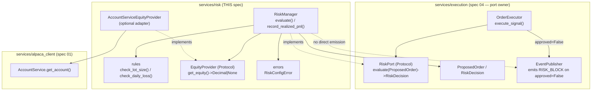

# Design Document

## Overview

This spec implements the **Risk Manager** of TradeBot: the last barrier applied **before** any order is sent to the Alpaca **paper trading** account (`https://paper-api.alpaca.markets`) for the single asset `BTC/USD`. It enforces two protection rules — a configurable **daily loss limit** and a configurable **maximum lot size** — and answers, for every proposed order, a single yes/no decision with a reason. It operates **exclusively in paper trading mode**; no real money is ever at risk.

This spec is the concrete implementation of the **risk port that spec `04-order-execution` already defined**. Spec `04` depends on a `RiskPort` (a `runtime_checkable` `Protocol` with `evaluate(proposed_order) -> RiskDecision`) and currently wires an interim pass-through `AllowAllRiskManager`. This spec `06` provides the real `RiskManager` that implements that port; the wiring that swaps `RiskManager` in for `AllowAllRiskManager` when the executor is built belongs to spec `07`/startup, **not here**.

The interface is **owned by spec `04` and is not changed or redefined here**. This spec **imports and reuses**:

- `ProposedOrder(symbol: str, side: str, qty: Decimal)` — the input to `evaluate`.
- `RiskDecision(approved: bool, reason: str)` — the output of `evaluate`.
- `RiskPort` — the `Protocol` `RiskManager` implements.

all from `app.services.execution.risk`.

Scope is intentionally minimal, matching the same bounded criteria as specs `01`–`04`: paper only, single asset `BTC/USD`, essential capabilities only.

The design covers the three requirements:

- **R1** Daily loss limit (positive configurable limit, per-UTC-day accumulated realized loss, reset on day change, block opening orders at/above the limit, allow protective closes).
- **R2** Position size / lot rule (`Max_Qty`, optional `Max_Equity_Pct`, `Effective_Allowed_Max`, invalid-qty rejection, equity-unavailable rejection).
- **R3** `RiskPort` implementation (single `evaluate` gate applying all rules, all-clear → approved, first violation → blocked with a rule-identifying reason, deterministic, never raises on a violation).

### Fit within the monorepo

Per the structure steering (`06-risk-manager → backend/app/services/risk/`), this spec adds one new self-contained domain package. It imports the port types from spec `04` and (optionally) the account service from spec `01`; it introduces **no new dependencies**.

New files introduced:

```
backend/app/services/risk/
  __init__.py     # package exports (RiskManager, EquityProvider, RiskConfigError)
  manager.py      # RiskManager (implements RiskPort.evaluate; owns daily-PnL state)
  rules.py        # pure rule helpers: lot-size check + daily-loss check
  equity.py       # EquityProvider (Protocol) + AccountServiceEquityProvider (optional adapter)
  errors.py       # RiskConfigError (raised at construction on invalid config)
```

Reused (imported, **not** duplicated):

| Existing asset | Role in this feature |
| --- | --- |
| `services/execution/risk.py` (`ProposedOrder`, `RiskDecision`, `RiskPort`) — spec 04 | The port `RiskManager` implements and the input/output types it uses. **Imported, never redefined** (R3.1). |
| `services/alpaca_client/account.py` (`AccountService.get_account`) — spec 01 | Optional backing source of `Account_Equity`, wrapped behind `EquityProvider` so `RiskManager` never imports it directly (R2.2, R2.7). |
| `services/execution/events.py` (`EventPublisher`, `OrderEvent`, `EventType.RISK_BLOCK`) — spec 04 | Referenced only for the RISK_BLOCK emission decision below; emission is **delegated to the executor** (R1.7). |

Both `services/execution/risk.py` and `services/execution/events.py` are pure Python (dataclasses, `Protocol`, `Enum`) with **no `alpaca` import**, so importing the port types does not pull the SDK into the risk package or its tests. If any transitive import ever changed that, this spec imports **only** `app.services.execution.risk`.

## Architecture

`RiskManager` is a thin, deterministic domain object. It holds configuration (limits) and a small piece of per-UTC-day state (accumulated realized loss). Its single public decision method, `evaluate`, delegates to two **pure rule helpers** and combines their results. It never constructs an Alpaca client and never talks to the network; equity, when needed, arrives through an injected `EquityProvider`.



### Key design decisions

- **Implement, do not redefine, the port.** `RiskManager` imports `ProposedOrder`, `RiskDecision`, and `RiskPort` from `app.services.execution.risk` and implements `evaluate`. Because `RiskPort` is `@runtime_checkable`, `isinstance(RiskManager(...), RiskPort)` holds structurally with no explicit inheritance (R3.1).

- **RISK_BLOCK emission is delegated to the executor (anti-double-event).** Spec `04`'s `OrderExecutor` already publishes exactly one `RISK_BLOCK` `OrderEvent` whenever `evaluate` returns `approved=False` (spec 04, R5.3). To avoid **double emission**, `RiskManager.evaluate` does **not** publish events itself in the normal flow; it satisfies R1.7 by returning `approved=False` **with a reason**, which the executor converts into the single `RISK_BLOCK` event. The primary and authoritative source of `RISK_BLOCK` is the executor. An **optional** `EventPublisher` may be injected for flows that consult risk without an executor; when present, emission is guarded so it is **at most once per block** and never occurs on the executor-driven path (the recommended default is to leave it unset and let the executor emit).

- **Equity behind a simple port.** `RiskManager` never touches `AccountService` directly. It depends on an `EquityProvider` `Protocol` (`get_equity() -> Decimal | None`), which keeps the manager decoupled and trivially mockable in tests. If `Max_Equity_Pct` is not configured, no `EquityProvider` is needed (R2.2, R2.7).

- **Opening vs. protective closes.** `ProposedOrder(symbol, side, qty)` carries **no** open/close flag. `evaluate` therefore treats every order it receives as an **`Opening_Order`** and applies the daily-loss rule to it. `Protective_Close`s (SL/TP closes managed by spec `04`'s `PositionManager`) are **always allowed** because the executor **does not consult risk for protective closes** — that path never calls `evaluate`. This satisfies R1.8 by construction (the daily-loss block only reaches orders that flow through `evaluate`, i.e. openings) and keeps the port signature unchanged.

- **Deterministic and total.** `evaluate` is a pure function of (current config, current per-day loss state, the proposed order). It reads state but never mutates it, so repeated calls with the same state and order return identical decisions (R3.5) and it **never raises for a rule violation** (R3.6) — violations become `approved=False` decisions. Only invalid **configuration** raises, and only at construction (R1.2, R2.1).

### Rule evaluation order

Within `evaluate`, rules are applied in a fixed order and the **first** violation determines the returned reason (deterministic precedence):

1. **Quantity validity** — `qty <= 0` (or not a valid `Decimal`) → `approved=False`, invalid-quantity reason. The lot comparison is **not** performed (R2.6).
2. **Lot size** — compute `Effective_Allowed_Max`; if equity is required but unavailable/non-positive → `approved=False`, equity-unavailable reason (R2.7); else if `qty > Effective_Allowed_Max` → `approved=False`, max-lot reason (R2.5).
3. **Daily loss** — if the current UTC day's accumulated loss `>= Daily_Loss_Limit` → `approved=False`, daily-loss reason (R1.4).
4. If none of the above → `approved=True` (R2.4, R1.5, R3.3).

## Components and Interfaces

### Reused port types (imported from spec 04)

```python
# In app/services/risk/manager.py and rules.py — imported, NOT redefined here.
from app.services.execution.risk import ProposedOrder, RiskDecision, RiskPort
# ProposedOrder(symbol: str, side: str, qty: Decimal)
# RiskDecision(approved: bool, reason: str)
# RiskPort: Protocol (runtime_checkable) with evaluate(proposed_order) -> RiskDecision
```

### Equity provider (`services/risk/equity.py`)

```python
from decimal import Decimal
from typing import Protocol, runtime_checkable


@runtime_checkable
class EquityProvider(Protocol):
    """Supplies the current Alpaca paper-account equity for the equity-based lot limit.

    Kept minimal and injectable so RiskManager stays decoupled from spec 01's
    AccountService and is trivially mockable in tests (R2.2, R2.7).
    """
    def get_equity(self) -> Decimal | None:
        """Return current Account_Equity, or None if it cannot be determined."""


class AccountServiceEquityProvider:
    """Optional adapter that sources equity from spec 01's AccountService.

    Wraps AccountService.get_account() and maps its equity/buying-power field to a
    Decimal. Returns None on any failure so the caller degrades to approved=False
    rather than crashing (R2.7). This adapter is the only place that touches spec 01.
    """
    def __init__(self, account_service) -> None: ...
    def get_equity(self) -> Decimal | None: ...
```

### Risk rules (`services/risk/rules.py`)

Pure functions — no state, no I/O — so they are directly and cheaply property-testable.

```python
from decimal import Decimal

from app.services.execution.risk import RiskDecision

# Stable, human-readable reason strings (no secrets).
REASON_INVALID_QTY = "invalid quantity"
REASON_MAX_LOT = "maximum lot size exceeded"
REASON_EQUITY_UNAVAILABLE = "equity-based limit could not be determined"
REASON_DAILY_LOSS = "daily loss limit reached"


def effective_allowed_max(
    max_qty: Decimal,
    max_equity_pct: Decimal | None,
    equity: Decimal | None,
) -> Decimal | None:
    """Return Effective_Allowed_Max (R2.2).

    - No max_equity_pct configured -> max_qty.
    - max_equity_pct configured and equity available and positive ->
      min(max_qty, equity * max_equity_pct / 100).
    - max_equity_pct configured but equity is None or <= 0 -> None (signals
      "cannot determine", handled by the caller as approved=False, R2.7).
    """


def check_lot_size(
    qty: Decimal,
    max_qty: Decimal,
    max_equity_pct: Decimal | None,
    equity: Decimal | None,
) -> RiskDecision | None:
    """Apply the lot-size rule (R2.3-R2.7). Returns a blocking RiskDecision, or None
    if this rule does not block.

      qty <= 0                          -> approved=False, REASON_INVALID_QTY (R2.6)
      equity required but unavailable   -> approved=False, REASON_EQUITY_UNAVAILABLE (R2.7)
      qty > effective_allowed_max       -> approved=False, REASON_MAX_LOT (R2.5)
      otherwise                         -> None (allowed by this rule, R2.4)
    """


def check_daily_loss(
    accumulated_loss: Decimal,
    daily_loss_limit: Decimal,
) -> RiskDecision | None:
    """Apply the daily-loss rule for an opening order (R1.4, R1.5). Returns a blocking
    RiskDecision when accumulated_loss >= daily_loss_limit, else None."""
```

### Risk manager (`services/risk/manager.py`)

```python
from datetime import datetime, timezone
from decimal import Decimal, InvalidOperation

from app.services.execution.risk import ProposedOrder, RiskDecision  # reused (R3.1)
from app.services.risk.equity import EquityProvider
from app.services.risk.errors import RiskConfigError
from app.services.risk import rules


class RiskManager:
    """Real RiskPort implementation: the single pre-order gate (R3.1).

    Enforces the daily loss limit (R1) and the maximum lot size (R2). Deterministic
    and total: evaluate() never raises for a rule violation (R3.6); only invalid
    configuration raises, at construction time (R1.2, R2.1).
    """

    def __init__(
        self,
        daily_loss_limit: Decimal,
        max_qty: Decimal,
        max_equity_pct: Decimal | None = None,
        equity_provider: EquityProvider | None = None,
        publisher=None,  # optional EventPublisher; see anti-double-event decision
    ) -> None:
        """Validate configuration and initialize per-day state.

        Raises RiskConfigError (a ValueError subclass) when:
          - daily_loss_limit <= 0                       (R1.2)
          - max_qty <= 0                                (R2.1)
          - max_equity_pct is set and not in (0, 100]   (R2.2)
        Initializes accumulated_loss = 0 for the current UTC day.
        """

    def record_realized_pnl(self, amount: Decimal, at: datetime | None = None) -> None:
        """Report realized P&L to the System (R1.3, R1.6).

        `at` defaults to the current UTC time. If `at`'s UTC date differs from the
        stored day, the accumulated loss is reset to zero first (R1.6), then this
        amount is applied. Losses (negative amounts) increase the day's accumulated
        loss; profits reduce it but never below zero.
        """

    def evaluate(self, proposed_order: ProposedOrder) -> RiskDecision:
        """The single gate spec 04 consults (R3.1-R3.6).

        Treats proposed_order as an Opening_Order (ProposedOrder has no open/close
        flag; protective closes bypass risk in spec 04). Applies rules in fixed order
        (quantity validity -> lot size -> daily loss); the first violation wins and
        its reason identifies the rule (R3.4). Returns approved=True only if no rule
        is violated (R3.3). Never raises for a violation (R3.6); deterministic and
        state-non-mutating so repeated calls match (R3.5).
        """
```

`evaluate` computes the current UTC day's `accumulated_loss` (resetting to zero if the stored day is stale, mirroring `record_realized_pnl`), fetches equity via `equity_provider.get_equity()` only when `max_equity_pct` is set, then calls `rules.check_lot_size(...)` and `rules.check_daily_loss(...)` in order, returning the first blocking `RiskDecision` or `RiskDecision(approved=True, reason="")`.

### Errors (`services/risk/errors.py`)

```python
class RiskConfigError(ValueError):
    """Raised at RiskManager construction when configuration is invalid (R1.2, R2.1).

    Subclasses ValueError so callers can catch either. NOT raised by evaluate() — rule
    violations are returned as RiskDecision(approved=False, ...), never as exceptions
    (R3.6).
    """
```

## Data Models

### Reused (spec 04, imported)

- **`ProposedOrder`** — frozen dataclass `(symbol: str, side: str, qty: Decimal)`; the input `evaluate` receives (R3.1).
- **`RiskDecision`** — frozen dataclass `(approved: bool, reason: str)`; the value `evaluate` returns (R3.3, R3.4).

Both are imported from `app.services.execution.risk`; this spec **does not** define them.

### Internal per-day loss state (`RiskManager`)

The only mutable state, kept private:

```python
_current_utc_day: date          # UTC calendar day the accumulated loss belongs to (R1.6)
_accumulated_loss: Decimal      # >= 0; the current UTC day's realized loss (R1.3)
```

Invariants:
- `_accumulated_loss >= 0` at all times (profits never drive it negative).
- On any `record_realized_pnl`/`evaluate` whose effective UTC date differs from `_current_utc_day`, the day is rolled and `_accumulated_loss` reset to `0` **before** applying new P&L (R1.6).

Configuration (immutable after construction): `daily_loss_limit: Decimal > 0`, `max_qty: Decimal > 0`, `max_equity_pct: Decimal | None` in `(0, 100]`. All monetary/quantity fields use `Decimal`, consistent with specs 01–04.

## Error Handling

`evaluate` is **total** for order inputs: every proposed order yields a `RiskDecision`, never an exception (R3.6). The only exceptions in this spec come from **invalid configuration at construction**.

| Cause | Behavior | Raises? | Result | Req |
| --- | --- | --- | --- | --- |
| `daily_loss_limit <= 0` at construction | Reject configuration | Yes (`RiskConfigError`) | no instance created | R1.2 |
| `max_qty <= 0` at construction | Reject configuration | Yes (`RiskConfigError`) | no instance created | R2.1 |
| `max_equity_pct` set and not in `(0, 100]` | Reject configuration | Yes (`RiskConfigError`) | no instance created | R2.2 |
| `qty <= 0` / not a valid `Decimal` | Reject as invalid; skip lot comparison | No | `RiskDecision(False, invalid-qty reason)` | R2.6 |
| `qty > Effective_Allowed_Max` | Block on lot size | No | `RiskDecision(False, max-lot reason)` | R2.5 |
| `max_equity_pct` set but equity `None`/`<= 0` | Cannot determine equity limit | No | `RiskDecision(False, equity-unavailable reason)` | R2.7 |
| Accumulated daily loss `>= Daily_Loss_Limit` (opening) | Block on daily loss | No | `RiskDecision(False, daily-loss reason)` | R1.4 |
| No rule violated | Allow | No | `RiskDecision(True, "")` | R2.4, R1.5, R3.3 |
| Multiple rules would fail | First in fixed order wins (qty → lot → daily loss) | No | `RiskDecision(False, first rule's reason)` | R3.4 |

Handling rules:

- **Configuration is the only hard failure.** Invalid limits/percentages raise `RiskConfigError` at construction; a constructed `RiskManager` is always in a valid state (R1.2, R2.1).
- **Violations never raise.** Every rule violation is expressed as `approved=False` with a rule-identifying, secret-free reason (R3.4, R3.6).
- **Deterministic & non-mutating.** `evaluate` reads state without mutating it, so identical (state, order) inputs always return identical decisions (R3.5).
- **RISK_BLOCK emission delegated.** A block produces `approved=False` + reason; spec 04's executor emits the single `RISK_BLOCK` event (no double emission) (R1.7).

## Correctness Properties

*A property is a characteristic or behavior that should hold true across all valid executions of a system—essentially, a formal statement about what the system should do. Properties serve as the bridge between human-readable specifications and machine-verifiable correctness guarantees.*

Property-based testing **is appropriate** here: `RiskManager.evaluate` and the pure rule helpers are deterministic input→output logic over a large space of quantities, limits, percentages, equities, and dates, with no I/O (the `EquityProvider` is mocked). Properties are intentionally kept to the essentials (6). Each is written for property-based testing (minimum 100 iterations).

### Property 1: Invalid quantity is rejected as invalid

*For any* `RiskManager` configuration and *for any* `ProposedOrder` whose `qty <= 0`, `evaluate` returns `approved=False` with the invalid-quantity reason, and does not compare `qty` against `Effective_Allowed_Max`.

**Validates: Requirements 2.6**

### Property 2: Lot-size boundary

*For any* valid `max_qty`, optional `max_equity_pct` in `(0, 100]`, positive equity, and positive `qty`: when `qty > Effective_Allowed_Max` (where `Effective_Allowed_Max = min(max_qty, equity * pct / 100)` or `max_qty` when no pct) `evaluate` returns `approved=False` with the max-lot reason, and when `0 < qty <= Effective_Allowed_Max` the lot rule does not block.

**Validates: Requirements 2.2, 2.4, 2.5**

### Property 3: An order within all limits is approved

*For any* `RiskManager` with a positive `qty <= Effective_Allowed_Max`, an available positive equity when `max_equity_pct` is set, and a current UTC-day accumulated loss below `Daily_Loss_Limit`, `evaluate` returns `approved=True`.

**Validates: Requirements 1.5, 2.4, 3.3**

### Property 4: Daily-loss boundary with UTC-day reset

*For any* positive `Daily_Loss_Limit` and any sequence of realized-P&L reports: an opening order is blocked with the daily-loss reason exactly when the current UTC day's accumulated loss `>= Daily_Loss_Limit` and is not blocked by this rule when it is `<` limit; and *for any* P&L reported on one UTC day, evaluating on a later UTC day starts from zero accumulated loss.

**Validates: Requirements 1.4, 1.5, 1.6**

### Property 5: `evaluate` is deterministic and never raises on a violation

*For any* `RiskManager` state and *for any* `ProposedOrder` (including invalid quantities), calling `evaluate` never raises and returns a `RiskDecision`, and two consecutive calls with the same state and the same order return equal `RiskDecision`s (state is not mutated).

**Validates: Requirements 3.5, 3.6**

### Property 6: `RiskManager` satisfies the spec-04 `RiskPort`

*For any* validly constructed `RiskManager`, `isinstance(instance, RiskPort)` is `True` against the `runtime_checkable` `RiskPort` `Protocol` imported from `app.services.execution.risk`.

**Validates: Requirements 3.1**

## Testing Strategy

Property-based testing covers the deterministic decision logic (the six properties above); focused unit/example tests cover configuration validation, equity-unavailable handling, rule precedence, and the RISK_BLOCK delegation, aligned with the Minimum Tests in the requirements. No network and no Alpaca SDK are involved: the `EquityProvider` is mocked, and the imported port types (`app.services.execution.risk`) are pure Python. To keep tests SDK-free, the risk tests import **only** `app.services.execution.risk` (never the executor/positions modules).

### Tooling

- **Framework:** `pytest` (configured in `backend/pyproject.toml` / `backend/tests/`), run in Docker (`docker compose run --rm backend pytest`).
- **Property-based library:** [Hypothesis](https://hypothesis.readthedocs.io/) — not hand-rolled. Generators build `Decimal` quantities/limits/percentages, `Decimal | None` equities, `ProposedOrder`s, `datetime`s across UTC-day boundaries, and P&L report sequences.
- **Mocking:** `EquityProvider` is a simple stub returning a configured `Decimal | None`; no `AccountService` or `alpaca` import is needed in tests.

### Property tests (min. 100 iterations each)

Each carries a comment tag: **Feature: 06-risk-manager, Property {n}: {property text}**. Property tests live beside the code they cover.

| Property | Focus | Notes |
| --- | --- | --- |
| P1 | Invalid qty → invalid | Generate `qty <= 0`; assert `approved=False`, invalid reason, no lot comparison. |
| P2 | Lot-size boundary | Generate `max_qty`, optional pct + equity, and `qty` around `Effective_Allowed_Max`; assert block iff `qty >` max. |
| P3 | All-clear → approved | Generate in-range qty, sufficient equity, loss below limit; assert `approved=True`. |
| P4 | Daily-loss boundary + reset | Generate limit and P&L reports (incl. cross-day `at`); assert block iff accumulated loss `>=` limit and reset on day change. |
| P5 | Deterministic + total | Generate any state + order; assert no raise and two equal decisions. |
| P6 | RiskPort conformance | Construct valid `RiskManager`; assert `isinstance(rm, RiskPort)`. |

### Unit / example tests (Minimum Tests + edges)

- **Loss below the limit allows the order** (Minimum Test): covered by P3/P4, plus a concrete example.
- **Loss at or above the limit blocks the order** (Minimum Test): covered by P4, plus a concrete example asserting the daily-loss reason.
- **Lot size within the max allowed** (Minimum Test): covered by P2/P3, plus a concrete example.
- **Lot size above the max rejected** (Minimum Test): covered by P2, plus a concrete example asserting the max-lot reason.
- **Invalid quantity rejected** (Minimum Test): covered by P1, plus a `qty = 0` and `qty < 0` example.
- **UTC day change resets loss** (Minimum Test): covered by P4, plus a concrete two-day example.
- **Deterministic evaluation** (Minimum Test): covered by P5, plus a concrete repeated-call example.
- **No exception on violation** (Minimum Test): covered by P5, plus an explicit invalid-qty no-raise example.
- **Satisfies the spec-04 RiskPort** (Minimum Test): covered by P6.
- **Config validation (R1.2, R2.1, R2.2):** `daily_loss_limit <= 0`, `max_qty <= 0`, and `max_equity_pct` outside `(0, 100]` each raise `RiskConfigError`; valid config constructs successfully.
- **Equity unavailable (R2.7):** with `max_equity_pct` set and the stubbed `EquityProvider` returning `None` / a non-positive value → `approved=False` with the equity-unavailable reason.
- **Rule precedence (R3.4):** an order that violates multiple rules (e.g. `qty <= 0` and would also exceed the lot / hit the daily loss) returns the first rule's reason in order (invalid-qty → lot → daily-loss).
- **Block emits RISK_BLOCK (R1.7):** a concrete example asserting that a block returns `approved=False` + reason and that the single `RISK_BLOCK` event is produced by the executor path (no double emission); if the optional `EventPublisher` is wired into `RiskManager`, assert it emits at most once and not on the executor-driven path.

### Requirements-to-minimum-tests mapping

| Minimum test (requirements.md) | Covered by |
| --- | --- |
| Loss below the limit allows the order | P3/P4 + example |
| Loss at or above the limit blocks the order | P4 + example |
| Lot size within the max allowed | P2/P3 + example |
| Lot size above the max rejected | P2 + example |
| Invalid quantity rejected | P1 + example |
| Block emits RISK_BLOCK | RISK_BLOCK delegation example (R1.7) |
| UTC day change resets loss | P4 + example |
| Deterministic evaluation | P5 + example |
| No exception on violation | P5 + example |
| Satisfies the spec-04 RiskPort | P6 |

### Requirements traceability summary

| Requirement | Components | Tests |
| --- | --- | --- |
| R1 (daily loss limit) | `RiskManager` (per-day state, `record_realized_pnl`, `evaluate`), `rules.check_daily_loss`, `errors.RiskConfigError`; RISK_BLOCK delegated to spec-04 executor | P3, P4; config-validation, RISK_BLOCK-delegation examples |
| R2 (position size / lot) | `rules.effective_allowed_max`, `rules.check_lot_size`, `equity.EquityProvider` (+ optional adapter), `errors.RiskConfigError` | P1, P2, P3; config-validation, equity-unavailable examples |
| R3 (RiskPort implementation) | `RiskManager.evaluate` (fixed rule order, first-violation reason), reused `ProposedOrder`/`RiskDecision`/`RiskPort` | P5, P6; rule-precedence example |
