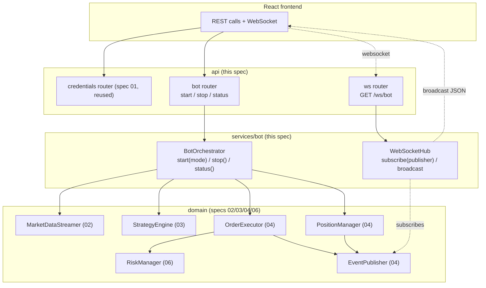
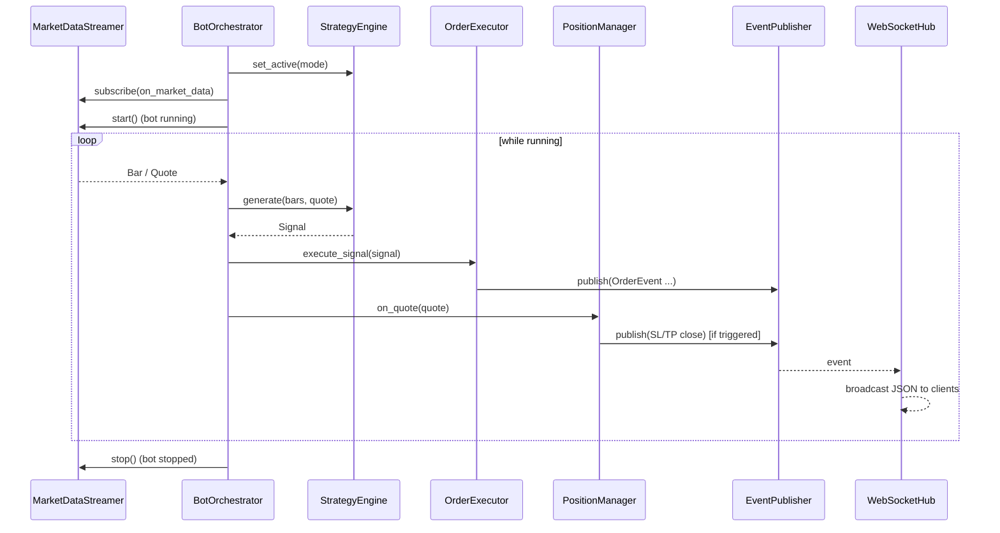

# Design Document

## Overview

This spec implements the **bot API**: the FastAPI orchestration layer that turns the
independently-built domain modules (specs `01`–`04`, `06`) into a running application, and
exposes them to the React frontend over REST + WebSocket. It operates **exclusively in paper
trading mode** for `BTC/USD`.

The layer is thin. It owns almost no domain logic; instead it:

- **Reuses** the spec-01 credential/account endpoints (already mounted) (R1).
- Adds a small **bot control** surface (`POST /bot/start`, `POST /bot/stop`,
  `GET /bot/status`) backed by a `BotOrchestrator` that wires the pipeline (R2).
- Adds a **WebSocket** endpoint (`GET /ws/bot`) backed by a `WebSocketHub` that bridges the
  spec-04 `EventPublisher` to all connected clients (R3).

The single most important integration decision: the real `RiskManager` (spec 06) is
**injected into the `OrderExecutor`**, replacing the interim `AllowAllRiskManager`.

The design covers the three requirements:

- **R1** Reuse the spec-01 credential/account endpoints; never leak the secret.
- **R2** Start/stop/status with a `BotOrchestrator` that runs and tears down the pipeline.
- **R3** A `WebSocketHub` that subscribes to the `EventPublisher` and broadcasts JSON events,
  dropping dead connections.

### Fit within the monorepo

Per the structure steering (`07-bot-api → backend/app/api/ + backend/app/main.py`), this spec
adds a small orchestration package plus API routers and wires everything in `main.py`. It
reuses every domain component and introduces no new heavy dependencies (FastAPI already
supports WebSockets).

| Existing asset | Role in this feature |
| --- | --- |
| `app/api/credentials.py` + `app/main.py` (spec 01) | Credential/account endpoints, reused and already mounted (R1). |
| `app/services/alpaca_client/` (spec 01) | `AlpacaClientFactory`, `AccountService`, `CredentialsRequiredError`, `CredentialRepository`. |
| `app/services/data_feed/` (spec 02) | `MarketDataStreamer` (start/stop/subscribe), `Bar`/`Quote`. |
| `app/services/strategies/` (spec 03) | `StrategyEngine`, `build_default_engine`, `Signal`, `UnknownStrategyError`. |
| `app/services/execution/` (spec 04) | `OrderExecutor`, `PositionManager`, `EventPublisher`, `OrderEvent`, `EventType`. |
| `app/services/risk/` (spec 06) | `RiskManager` injected into the `OrderExecutor`. |

New files introduced:

```
backend/app/
  services/bot/
    __init__.py        # package exports
    orchestrator.py    # BotOrchestrator: build pipeline, start/stop, status
    state.py           # BotState enum + BotStatus dataclass
  api/
    bot.py             # REST router: POST /bot/start, POST /bot/stop, GET /bot/status
    ws.py              # WebSocketHub + GET /ws/bot endpoint
  schemas/
    bot.py             # Pydantic: BotStartRequest, BotStatusResponse
```

`app/main.py` is extended to build the shared singletons (engine, publisher, streamer,
risk manager, executor, position manager, orchestrator, hub) and mount the new routers.

## Architecture

The `BotOrchestrator` is the only stateful piece. It holds the wired pipeline and the current
`BotState`, and exposes `start(mode)`, `stop()`, and `status()`. The REST router is a thin
delegation to it. The `WebSocketHub` is independent: it subscribes to the `EventPublisher`
once at startup and fans out every event to the connected sockets.



### Pipeline wiring (what "running" means)

When the bot is running, each live `Quote`/`Bar` from the `MarketDataStreamer` drives two
independent consumers, both registered via `streamer.subscribe(...)`:



The orchestrator keeps a rolling buffer of recent bars to feed `StrategyEngine.generate`
(which needs a bar sequence). Quotes are forwarded to `PositionManager.on_quote`.

### Key design decisions

- **Inject the real risk manager.** At startup the `OrderExecutor` is built with a
  `RiskManager` (spec 06) instead of `AllowAllRiskManager`. The executor depends only on the
  `RiskPort`, so this is a construction-time swap with no executor changes (R2, integration).
- **Orchestrator owns lifecycle, router stays thin.** The router validates input and
  delegates to `BotOrchestrator`; all state transitions live in one place, making
  idempotent start and clean stop easy to reason about (R2.2, R2.5, R2.8).
- **Reuse, don't reimplement, credentials.** The spec-01 router is already mounted; this spec
  asserts its presence and adds only the new surface (R1).
- **Hub bridges publisher to sockets, tolerant to failure.** The `WebSocketHub` subscribes to
  the `EventPublisher` once; a send failure or disconnect drops that socket and never breaks
  the broadcast loop or the bot (R3.4, R3.5). Events are serialized from the secret-free
  `OrderEvent` fields only (R3.3).
- **Paper-only preserved.** The pipeline uses the same `AlpacaClientFactory` (paper barrier
  from spec 01); the bot API adds no path to live trading (R2.7).

## Components and Interfaces

### Bot state (`services/bot/state.py`)

```python
from dataclasses import dataclass
from enum import Enum


class BotState(str, Enum):
    RUNNING = "running"
    STOPPED = "stopped"


@dataclass(frozen=True)
class BotStatus:
    """Snapshot returned by GET /bot/status (R2.6)."""
    state: BotState
    mode: str          # active StrategyEngine mode (e.g. "random")
    symbol: str        # e.g. "BTC/USD"
```

### Bot orchestrator (`services/bot/orchestrator.py`)

```python
from app.services.data_feed.streaming import MarketDataStreamer
from app.services.execution.executor import OrderExecutor
from app.services.execution.positions import PositionManager
from app.services.strategies.registry import StrategyEngine
from app.services.bot.state import BotState, BotStatus


class BotOrchestrator:
    """Owns the bot lifecycle and the wired pipeline (R2).

    Holds the shared singletons and the current BotState. Starting subscribes the
    market-data consumers and starts the streamer; stopping stops and releases it.
    """

    def __init__(
        self,
        streamer: MarketDataStreamer,
        engine: StrategyEngine,
        executor: OrderExecutor,
        position_manager: PositionManager,
        symbol: str = "BTC/USD",
    ) -> None: ...

    async def start(self, mode: str) -> BotStatus:
        """Start the pipeline in the given mode (R2.2, R2.4, R2.8).

        - Sets the active mode via engine.set_active(mode); an unregistered mode
          raises UnknownStrategyError (mapped to a clear error) and leaves state
          unchanged (R2.4).
        - Credential availability is checked before starting; missing credentials
          surface CredentialsRequiredError (R2.3) — the caller maps it to a clear error.
        - Subscribes on_market_data (feeds engine+executor) and position_manager.on_quote
          to the streamer, then starts the streamer, transitioning to RUNNING.
        - If already RUNNING, it is idempotent: returns the current status without
          starting a second pipeline (R2.8).
        """

    async def stop(self) -> BotStatus:
        """Stop the pipeline and release the streamer, transitioning to STOPPED (R2.5)."""

    def status(self) -> BotStatus:
        """Return the current BotState, active mode, and symbol (R2.6)."""
```

`on_market_data(datum)` (internal): appends bars to a rolling buffer, calls
`engine.generate(bars, quote)`, and passes the resulting `Signal` to
`executor.execute_signal(signal)`; it also forwards quotes to `position_manager.on_quote`.
Exceptions in a single tick are caught and logged so one bad tick never stops the bot.

Credential check: the orchestrator (or the router) verifies a valid credential set exists
before starting; if not, `CredentialsRequiredError` is surfaced and the pipeline does not
start (R2.3).

### WebSocket hub (`api/ws.py`)

```python
from fastapi import APIRouter, WebSocket
from app.services.execution.events import EventPublisher, OrderEvent

router = APIRouter()


class WebSocketHub:
    """Bridges the spec-04 EventPublisher to all connected WebSocket clients (R3)."""

    def __init__(self, publisher: EventPublisher) -> None:
        """Subscribe self._on_event to the publisher once (R3.2)."""

    async def connect(self, websocket: WebSocket) -> None:
        """Accept and register a client connection."""

    def disconnect(self, websocket: WebSocket) -> None:
        """Remove a client from the connection set (R3.4)."""

    def _on_event(self, event: OrderEvent) -> None:
        """Publisher callback: enqueue the event for broadcast (secret-free, R3.3)."""

    async def broadcast(self, event: OrderEvent) -> None:
        """Send the JSON-serialized event to every client; drop any that fail (R3.5)."""


@router.websocket("/ws/bot")
async def bot_feed(websocket: WebSocket) -> None:
    """Register the client, keep the connection open, and clean up on disconnect (R3.1, R3.4)."""
```

Serialization: an `OrderEvent` is converted to a JSON-safe dict using only its declared,
secret-free fields (`event_type`, `symbol`, `side`, `qty`→str, `price`→str, `order_id`,
`reason`, `timestamp`→ISO). No credential material is ever part of an `OrderEvent`, so the
broadcast is secret-free by construction (R3.3).

The publisher's callbacks are synchronous; the hub bridges to async sends via an
`asyncio.Queue` (or `run_coroutine_threadsafe` against the app loop), so `_on_event` never
blocks the publisher and a slow/broken client cannot stall event production.

### REST router (`api/bot.py`)

```python
from fastapi import APIRouter, status
from app.schemas.bot import BotStartRequest, BotStatusResponse

router = APIRouter(prefix="/bot", tags=["bot"])


@router.post("/start", response_model=BotStatusResponse)
async def start_bot(body: BotStartRequest) -> BotStatusResponse:
    """Start the bot in the requested mode (R2.1, R2.2). Maps CredentialsRequiredError
    -> 409 no_credentials (R2.3) and UnknownStrategyError -> 400 invalid_mode (R2.4);
    already-running is idempotent (R2.8)."""


@router.post("/stop", response_model=BotStatusResponse)
async def stop_bot() -> BotStatusResponse:
    """Stop the bot and return the resulting status (R2.5)."""


@router.get("/status", response_model=BotStatusResponse)
def bot_status() -> BotStatusResponse:
    """Return the current bot status (R2.6)."""
```

| Method & path | Purpose | Success | Req |
| --- | --- | --- | --- |
| `POST /bot/start` | Start pipeline in a mode | `200` `BotStatusResponse` | R2.1–R2.4, R2.8 |
| `POST /bot/stop` | Stop pipeline | `200` `BotStatusResponse` | R2.5 |
| `GET /bot/status` | Current state | `200` `BotStatusResponse` | R2.6 |
| `GET /ws/bot` | Real-time event feed | WebSocket | R3 |

### Schemas (`schemas/bot.py`)

```python
from typing import Literal
from pydantic import BaseModel


class BotStartRequest(BaseModel):
    mode: Literal["random", "predictive"]   # rejects unknown modes at the edge (R2.4)


class BotStatusResponse(BaseModel):
    state: str    # "running" | "stopped"
    mode: str
    symbol: str
```

### Wiring in `app/main.py`

At startup, `main.py` builds the shared singletons once and mounts the routers:

```python
publisher = EventPublisher()
engine = build_default_engine()                     # spec 03
# RiskManager (spec 06) injected in place of AllowAllRiskManager:
risk = RiskManager(daily_loss_limit=..., max_qty=...)
# factory/streamer/executor/position_manager built from the shared repository/settings:
executor = OrderExecutor(factory, risk, publisher)  # spec 04 + spec 06
position_manager = PositionManager(factory, publisher)
streamer = MarketDataStreamer(factory)              # spec 02
orchestrator = BotOrchestrator(streamer, engine, executor, position_manager)
hub = WebSocketHub(publisher)                        # subscribes to the publisher

app.include_router(bot_router)
app.include_router(ws_router)
# credentials/account routers (spec 01) are already mounted.
```

Concrete risk limits (`daily_loss_limit`, `max_qty`, optional `max_equity_pct`) come from
configuration (`Settings`), with safe defaults, keeping the bot conservative by default.

## Data Models

- **`BotState`** — `str` enum (`running` / `stopped`).
- **`BotStatus`** — frozen dataclass (`state`, `mode`, `symbol`); the domain snapshot.
- **`BotStartRequest`** — Pydantic input; `mode` is a `Literal["random","predictive"]` so an
  unknown mode is rejected at the API edge (defense in depth alongside R2.4).
- **`BotStatusResponse`** — Pydantic output mirroring `BotStatus`.
- **Reused: `OrderEvent`** (spec 04) — the only event shape broadcast; secret-free by
  construction. The hub serializes it to a JSON-safe dict (Decimals→str, datetime→ISO).

No new persistent tables are introduced; bot state is in-memory (a single-user, single-bot
phase).

## Error Handling

The REST layer maps domain errors to distinguishable HTTP responses, reusing the
`_error_response` helper/pattern already in `main.py`. Broadcasting never raises to callers.

| Cause | Behavior | HTTP / effect | Req |
| --- | --- | --- | --- |
| `POST /bot/start`, no credentials | `CredentialsRequiredError` surfaced | `409` `no_credentials`, not started | R2.3 |
| `POST /bot/start`, invalid/unknown mode | rejected at edge (Pydantic) or `UnknownStrategyError` | `400`/`422` `invalid_mode`, state unchanged | R2.4 |
| `POST /bot/start` while running | idempotent | `200` current status, no second pipeline | R2.8 |
| `POST /bot/stop` | stop + release streamer | `200` `stopped` | R2.5 |
| Exception in a single market-data tick | caught + logged | bot keeps running | R2 (resilience) |
| WebSocket client disconnects | removed from set | others unaffected | R3.4 |
| Send to a WebSocket client fails | drop that connection | broadcast continues | R3.5 |

Handling rules:

- **Clear, distinguishable errors.** `409 no_credentials` vs `400 invalid_mode` let the
  frontend react precisely (R2.3, R2.4).
- **Idempotent start.** Starting while running returns the current status rather than raising
  or double-starting (R2.8).
- **Broadcast is best-effort.** A failing/disconnected socket is dropped; the loop continues
  for the rest and the bot is never interrupted (R3.4, R3.5).
- **No secrets in transit.** Only `OrderEvent`'s declared fields are serialized; credential
  material never enters an event (R3.3).

## Correctness Properties

*A property is a characteristic or behavior that should hold true across all valid executions
of a system—essentially, a formal statement about what the system should do. Properties serve
as the bridge between human-readable specifications and machine-verifiable correctness
guarantees.*

These target the deterministic control/broadcast logic (state transitions, error mapping,
fan-out, serialization) with the domain components and Alpaca mocked. Each is written for
property-based testing (minimum 100 iterations). The properties are kept to the essentials.

### Property 1: Start without credentials never starts and errors clearly

*For any* start request when no credentials are configured, the orchestrator does not start
the streamer, the bot state remains `stopped`, and a `no_credentials` error is surfaced.

**Validates: Requirements 2.3**

### Property 2: Invalid mode leaves state unchanged

*For any* mode not in the registered set, `POST /bot/start` returns a clear `invalid_mode`
error and the bot state is unchanged (the streamer is not started).

**Validates: Requirements 2.4**

### Property 3: Start is idempotent while running

*For any* sequence of start calls with valid mode and credentials, at most one pipeline is
started: the streamer's `start` is invoked once until a `stop` occurs, and status stays
`running`.

**Validates: Requirements 2.2, 2.8**

### Property 4: Stop returns to stopped and releases the streamer

*For any* running bot, `POST /bot/stop` stops the streamer and the reported status is
`stopped`.

**Validates: Requirements 2.5, 2.6**

### Property 5: Every published event reaches all healthy clients

*For any* set of connected WebSocket clients and any published `OrderEvent`, every healthy
client receives the JSON-serialized event exactly once.

**Validates: Requirements 3.2**

### Property 6: A failing client is dropped without affecting others

*For any* set of clients in which some fail on send, `broadcast` delivers to all healthy
clients, removes the failing ones, and returns normally (the bot is not interrupted).

**Validates: Requirements 3.4, 3.5**

### Property 7: Broadcast events contain no secrets

*For any* `OrderEvent` broadcast, the serialized payload contains no API key, secret, or
credential material and only the event's declared fields.

**Validates: Requirements 3.3**

## Testing Strategy

Property-based testing **is appropriate** for the state machine, error mapping, and hub
fan-out/serialization, which are deterministic logic over a large input space. FastAPI's
`TestClient` covers REST + WebSocket endpoints; the domain components (streamer, engine,
executor, position manager) and Alpaca are mocked, so tests are fast and network-free.

### Tooling

- **Framework:** `pytest` (configured in `backend/pyproject.toml` / `tests/`), run in Docker.
- **Property-based library:** [Hypothesis](https://hypothesis.readthedocs.io/) — not
  hand-rolled. Generators build client sets, event streams, and mode/credential states.
- **API tests:** FastAPI `TestClient` for REST and its WebSocket test support; the
  `MarketDataStreamer.start/stop` and `OrderExecutor`/`RiskManager` are mocked/faked. Alpaca
  is stubbed via `sys.modules` as in prior specs where an import would otherwise require it.
- **Async:** `pytest-asyncio` for orchestrator `start`/`stop` and hub broadcast.

### Property tests (min. 100 iterations each)

Each test carries a comment tag: **Feature: 07-bot-api, Property {n}: {property text}**.

| Property | Focus | Notes |
| --- | --- | --- |
| P1 | Start without credentials | No streamer start; state stays stopped; `no_credentials`. |
| P2 | Invalid mode | Clear `invalid_mode`; state unchanged. |
| P3 | Idempotent start | Streamer started once across repeated starts. |
| P4 | Stop returns stopped | Streamer stopped; status `stopped`. |
| P5 | Fan-out to all healthy clients | Each healthy client receives the event once. |
| P6 | Failing client dropped | Healthy clients still receive; failing removed; no raise. |
| P7 | No secrets in broadcast | Serialized payload free of credential substrings. |

### Unit / example tests (Minimum Tests)

- **`/health` reports paper mode:** already covered by the skeleton; re-assert after wiring.
- **Credentials surface available (R1):** `TestClient` smoke test that `GET /credentials`
  returns metadata only and never the secret (reused spec-01 behavior).
- **Start without credentials (R2.3):** `POST /bot/start` → `409 no_credentials`, streamer not
  started (mock spy).
- **Invalid mode (R2.4):** `POST /bot/start` with a bad mode → `400/422`, state unchanged.
- **Valid start (R2.2):** with credentials + valid mode → `engine.set_active(mode)` called,
  streamer started, status `running`.
- **Stop (R2.5, R2.6):** `POST /bot/stop` → streamer stopped, `GET /bot/status` → `stopped`.
- **Idempotent start (R2.8):** covered by P3, plus an example asserting a single streamer
  start.
- **WebSocket receives an event (R3.2):** a client connected to `/ws/bot` receives an event
  published to the `EventPublisher`.
- **No secrets broadcast (R3.3):** covered by P7, plus a concrete example.
- **Dead client dropped (R3.4, R3.5):** covered by P6, plus a concrete two-client example.

### Requirements-to-minimum-tests mapping

| Minimum test (requirements.md) | Covered by |
| --- | --- |
| `/health` reports paper mode | skeleton test |
| Credentials stored encrypted / no secret exposed | spec-01 reuse smoke test |
| Start without credentials → error | P1 + example (R2.3) |
| Start invalid mode → error, unchanged | P2 + example (R2.4) |
| Valid start → running | R2.2 example |
| Stop → stopped | P4 + example |
| Status returns state/mode/symbol | R2.6 example |
| WebSocket receives an event | R3.2 example |
| Broadcast has no secrets | P7 + example |
| Failing client dropped | P6 + example |

### Requirements traceability summary

| Requirement | Components | Tests |
| --- | --- | --- |
| R1 (credentials/account reused) | spec-01 routers (mounted), `main.py` wiring | credentials smoke test |
| R2 (bot control) | `BotOrchestrator`, `api/bot.py`, `schemas/bot.py`, `BotState`/`BotStatus` | P1–P4; R2.2/R2.6 examples |
| R3 (WebSocket feed) | `WebSocketHub`, `api/ws.py`, `OrderEvent` serialization | P5, P6, P7; R3.2 example |
