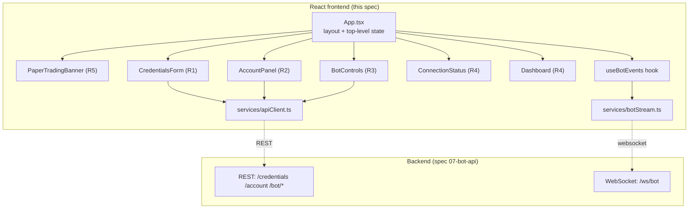
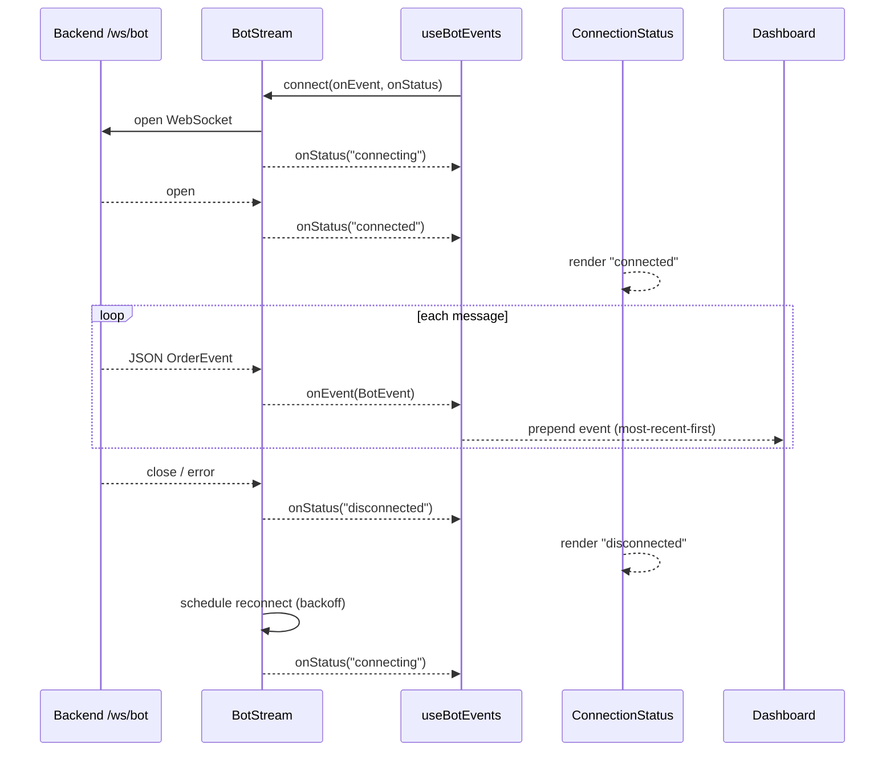
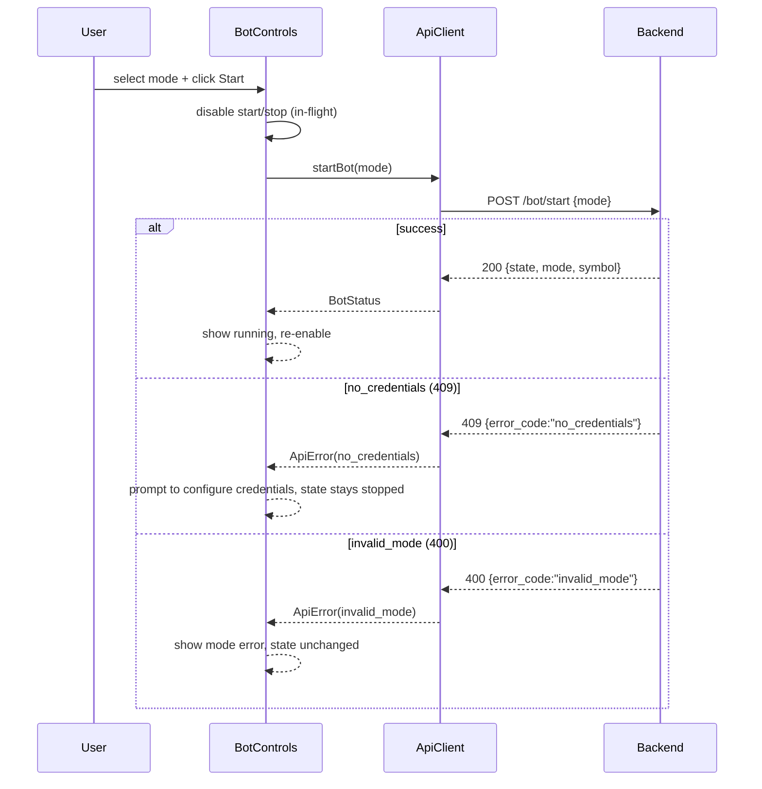

# Design Document

## Overview

This spec implements the **web frontend** of TradeBot: a React + TypeScript (Vite)
single-page application that lets a single user configure Alpaca credentials, control the
trading bot, and observe its actions in **real time**. The Frontend is a pure client of the
spec `07-bot-api` surface; it owns no domain logic. It renders Backend state and forwards
user intent over REST and WebSocket.

The Frontend operates **exclusively in paper trading mode** for `BTC/USD`, and makes that
context visible at all times (R5).

The design covers the five requirements:

- **R1** Credentials form (masked Secret), save/read/delete, metadata-only display, error
  resilience.
- **R2** Load and display the paper account (balance + status) once credentials exist.
- **R3** Mode selection and start/stop control with in-flight disabling and status display.
- **R4** Real-time Dashboard fed by the WebSocket, most-recent-first, with reconnection and a
  Connection_Status indicator.
- **R5** A persistent Paper_Trading_Indicator on every view.

### Fit within the monorepo

Per the structure steering (`08-web-frontend → frontend/src/`), this spec **extends** the
existing skeleton rather than starting fresh. `App.tsx` is replaced by a real composition of
components; `services/apiClient.ts` and `services/botStream.ts` are extended with the
credential/account/bot methods and the event stream respectively.

| Existing asset | Role in this feature |
| --- | --- |
| `src/main.tsx` | Mounts `<App/>` — unchanged. |
| `src/App.tsx` | Replaced: layout + composition of the real components. |
| `src/services/apiClient.ts` | Extended: `getCredentials`/`saveCredentials`/`deleteCredentials`/`getAccount`/`startBot`/`stopBot`/`getBotStatus`. |
| `src/services/botStream.ts` | Extended: `connect(onEvent, onStatus)` with backoff reconnection. |
| `src/vite-env.d.ts` | Reused: `VITE_API_BASE_URL`, `VITE_WS_BASE_URL`. |
| `Dockerfile` / `nginx.conf` | Reused: multi-stage node build → static assets behind nginx. |

New files introduced:

```
frontend/src/
  App.tsx                       # replaced: layout + composition
  types.ts                      # shared TS types (contracts of spec 07)
  hooks/
    useBotEvents.ts             # manages WS connection + event list + connection status
  components/
    PaperTradingBanner.tsx      # R5 persistent indicator
    CredentialsForm.tsx         # R1
    AccountPanel.tsx            # R2
    BotControls.tsx             # R3
    ConnectionStatus.tsx        # R4 status indicator
    Dashboard.tsx               # R4 event list
```

Test tooling (**added devDeps**): `vitest`, `@testing-library/react`, `@testing-library/jest-dom`,
`jsdom`. `vite.config.ts` gains a `test` block (jsdom environment). No production dependency
is added.

## Architecture

The Frontend is a thin presentation layer. `App.tsx` owns top-level state (credentials
metadata, account, bot status) and composes the components. Two service modules isolate all
I/O: `ApiClient` (REST) and `BotStream` (WebSocket). The `useBotEvents` hook wraps `BotStream`
and exposes the event list + connection status to the Dashboard.



### Live event flow (R4)



### Bot start flow (R3)



### Key design decisions

- **Secret is never in React state.** The `CredentialsForm` reads the Secret from the input
  field only at submit time (via the input's value / a ref), never stores it in component
  state, and never renders it. After submit only metadata (last4, validation_status) is shown
  (R1.3, R1.5).
- **All I/O is isolated in two services.** Components never call `fetch`/`WebSocket`
  directly; they call `ApiClient`/`BotStream` (through `useBotEvents`). This keeps components
  test-friendly (mock the services) and matches the existing structure.
- **`ApiClient` normalizes errors to a stable `ApiError` with `error_code`.** The Backend
  returns a stable `error_code`; the client surfaces it so components can distinguish
  `no_credentials` from `invalid_mode` from network failures (R1.7, R3.6, R3.7).
- **Reconnection with capped exponential backoff.** `BotStream` reconnects after a lost
  connection with delays `1s → 2s → 4s → 8s`, capped at `30s`, emitting `connecting` /
  `connected` / `disconnected` via `onStatus` (R4.4, R4.5).
- **Most-recent-first by construction.** `useBotEvents` prepends each incoming event, so the
  Dashboard renders newest first without sorting on every render (R4.3).
- **Paper indicator lives in the layout.** The `PaperTradingBanner` is rendered by `App.tsx`
  outside any conditional branch, so it is present on every view (R5).

## Components and Interfaces

### Shared types (`types.ts`)

```typescript
export type Mode = "random" | "predictive";

export type ConnectionStatus = "connected" | "connecting" | "disconnected";

export type EventType =
  | "SUBMITTED"
  | "FILLED"
  | "REJECTED"
  | "ERROR"
  | "RISK_BLOCK"
  | "STOP_LOSS_CLOSE"
  | "TAKE_PROFIT_CLOSE";

/** Non-sensitive metadata from GET /credentials — never includes the Secret (R1.5). */
export interface CredentialMetadata {
  exists: boolean;
  key_id_last4: string | null;
  validation_status: string | null;
  updated_at: string | null;
}

/** GET /account snapshot (R2.2). */
export interface AccountStatus {
  cash: string;
  buying_power: string;
  status: string;
  mode: "paper";
}

/** GET /bot/status snapshot (R3.5). */
export interface BotStatus {
  state: "running" | "stopped";
  mode: Mode;
  symbol: string;
}

/** A JSON-serialized OrderEvent received over the WebSocket (R4.2). */
export interface BotEvent {
  event_type: EventType;
  symbol: string;
  side: string | null;
  qty: string | null;
  price: string | null;
  order_id: string | null;
  reason: string | null;
  timestamp: string;
}

/** Normalized error carrying the Backend's stable error_code. */
export interface ApiError {
  error_code: string; // e.g. "no_credentials", "invalid_mode", "network", "unknown"
  message: string;
  status?: number;
}
```

### REST client (`services/apiClient.ts`, extended)

```typescript
export class ApiError extends Error {
  readonly error_code: string;
  readonly status?: number;
  constructor(error_code: string, message: string, status?: number);
}

export class ApiClient {
  readonly baseUrl: string;
  constructor(baseUrl?: string);

  health(): Promise<HealthResponse>;               // existing

  // Credentials (R1)
  getCredentials(): Promise<CredentialMetadata>;                       // GET /credentials
  saveCredentials(apiKey: string, secret: string): Promise<CredentialMetadata>; // POST /credentials
  deleteCredentials(): Promise<{ deleted: boolean; detail: string }>;  // DELETE /credentials

  // Account (R2)
  getAccount(): Promise<AccountStatus>;            // GET /account

  // Bot control (R3)
  startBot(mode: Mode): Promise<BotStatus>;        // POST /bot/start {mode}
  stopBot(): Promise<BotStatus>;                   // POST /bot/stop
  getBotStatus(): Promise<BotStatus>;              // GET /bot/status
}

export const apiClient: ApiClient;
```

Every method is `async`. On a non-OK response the client reads the JSON body, extracts
`error_code` when present, and throws `ApiError(error_code, message, status)`. A network/parse
failure throws `ApiError("network", ...)` (R1.7, R2.3, R3.6, R3.7). `saveCredentials` sends
`{ api_key, secret }` and returns only metadata — the Secret argument is never retained.

### WebSocket client (`services/botStream.ts`, extended)

```typescript
export type BotEventHandler = (event: BotEvent) => void;
export type ConnectionStatusHandler = (status: ConnectionStatus) => void;

export class BotStream {
  readonly url: string;
  constructor(url?: string);

  /** Open the connection and stream events; auto-reconnect with capped backoff (R4.1, R4.4). */
  connect(onEvent: BotEventHandler, onStatus: ConnectionStatusHandler): void;

  /** Close the connection and stop reconnection attempts. */
  disconnect(): void;
}
```

Behavior:

- On `connect`, emits `onStatus("connecting")`, opens the socket, and on `open` emits
  `onStatus("connected")` (R4.5).
- Each `message` is `JSON.parse`d into a `BotEvent` and passed to `onEvent` (R4.2). A malformed
  message is ignored (logged), never crashing the stream.
- On `close`/`error` (while not explicitly disconnected), emits `onStatus("disconnected")` and
  schedules a reconnect with **capped exponential backoff**: `1s, 2s, 4s, 8s, …` capped at
  `30s`, resetting to `1s` after a successful `open` (R4.4). Each retry re-emits
  `onStatus("connecting")`.
- `disconnect()` cancels any pending timer and closes the socket without reconnecting.

### `useBotEvents` hook (`hooks/useBotEvents.ts`)

```typescript
export interface UseBotEvents {
  events: BotEvent[];              // most-recent-first (R4.3)
  connectionStatus: ConnectionStatus;
}

/** Owns a BotStream for the component lifetime: connect on mount, disconnect on unmount. */
export function useBotEvents(stream?: BotStream): UseBotEvents;
```

On mount it calls `stream.connect(onEvent, onStatus)`; `onEvent` prepends to `events`
(newest first), `onStatus` updates `connectionStatus`. On unmount it calls
`disconnect()`. The optional `stream` parameter lets tests inject a mock.

### Components

```typescript
// PaperTradingBanner.tsx (R5) — no props; always rendered by App.
export function PaperTradingBanner(): JSX.Element;

// CredentialsForm.tsx (R1)
export interface CredentialsFormProps {
  metadata: CredentialMetadata;
  onSave: (apiKey: string, secret: string) => Promise<void>;
  onDelete: () => Promise<void>;
  error?: string | null;
}
export function CredentialsForm(props: CredentialsFormProps): JSX.Element;

// AccountPanel.tsx (R2)
export interface AccountPanelProps {
  account: AccountStatus | null;
  error?: string | null;
}
export function AccountPanel(props: AccountPanelProps): JSX.Element;

// BotControls.tsx (R3)
export interface BotControlsProps {
  status: BotStatus;
  busy: boolean;                          // disables start/stop while a request is in flight (R3.8)
  onStart: (mode: Mode) => Promise<void>;
  onStop: () => Promise<void>;
  error?: string | null;
}
export function BotControls(props: BotControlsProps): JSX.Element;

// ConnectionStatus.tsx (R4.5)
export interface ConnectionStatusProps {
  status: ConnectionStatus;
}
export function ConnectionStatus(props: ConnectionStatusProps): JSX.Element;

// Dashboard.tsx (R4.2, R4.3)
export interface DashboardProps {
  events: BotEvent[];                     // already most-recent-first
}
export function Dashboard(props: DashboardProps): JSX.Element;
```

Component notes:

- **CredentialsForm** renders an API Key ID text input and a **masked** Secret input
  (`type="password"`). The Secret is read at submit time and passed to `onSave`; it is never
  stored in state nor rendered afterward (R1.1, R1.3). When `metadata.exists` is true it shows
  `key_id_last4` and `validation_status` and a delete action (R1.5, R1.6); it never shows the
  Secret. On error it shows `error` while keeping the current metadata visible (R1.7).
- **AccountPanel** renders balance (`cash`/`buying_power`) and `status` when `account` is
  present; otherwise shows the load error (R2.2, R2.3).
- **BotControls** renders a `random`/`predictive` selector, Start and Stop buttons (both
  disabled while `busy`), and the current `state`, `mode`, and `symbol` (R3.1, R3.5, R3.8).
  Errors (`no_credentials`, `invalid_mode`, network) are shown via `error` (R3.6, R3.7).
- **Dashboard** maps `events` to rows showing `event_type`, `symbol`, `side`, `qty`, `price`,
  and `timestamp`, in received order (already newest-first) (R4.2, R4.3).
- **PaperTradingBanner** renders a persistent notice that the app runs in paper trading with
  no real money; `App.tsx` renders it unconditionally (R5).

### Composition and load sequence (`App.tsx`)

On mount, `App` calls `getCredentials()`; if credentials exist it also calls `getAccount()`
(R2.1) and `getBotStatus()` (R3.4). It renders `PaperTradingBanner`, `CredentialsForm`,
`AccountPanel`, `BotControls`, `ConnectionStatus`, and `Dashboard`, wiring `onSave`/`onDelete`/
`onStart`/`onStop` to `ApiClient` and passing per-section error state down. `useBotEvents`
supplies `events` and `connectionStatus`.

## Data Models

All models are TypeScript types (client-side only; no persistence). They mirror the spec-07
contract.

- **`Mode`** — union `"random" | "predictive"` (R3.1).
- **`ConnectionStatus`** — union `"connected" | "connecting" | "disconnected"` (R4.5).
- **`EventType`** — union of the seven `OrderEvent` types (R4.2).
- **`CredentialMetadata`** — `{ exists, key_id_last4, validation_status, updated_at }`;
  **never** contains the Secret (R1.5).
- **`AccountStatus`** — `{ cash, buying_power, status, mode: "paper" }` (R2.2).
- **`BotStatus`** — `{ state, mode, symbol }` (R3.5).
- **`BotEvent`** — the JSON-serialized `OrderEvent` fields (R4.2).
- **`ApiError`** — `{ error_code, message, status? }`; the normalized error surface (R1.7).

**Secret handling invariant:** the plaintext API Secret exists only transiently in the
Secret input element and the `saveCredentials` argument. It is never placed in React state,
never part of any model above, and never rendered (R1.3).

## Error Handling

`ApiClient` maps every failure to an `ApiError` carrying a stable `error_code`; components
translate that into a user-facing message and the required state behavior.

| Cause | `error_code` | UI behavior | Req |
| --- | --- | --- | --- |
| Credentials request fails (any) | `network`/backend code | Show error; keep previous metadata | R1.7 |
| Account request fails | `network`/backend code | Show "account could not be loaded" | R2.3 |
| `POST /bot/start` no credentials | `no_credentials` (409) | Show "configure credentials"; state stays `stopped` | R3.6 |
| `POST /bot/start` invalid mode | `invalid_mode` (400/422) | Show mode error; state unchanged | R3.7 |
| Network/parse failure (REST) | `network` | Generic error message | R1.7, R2.3 |
| WebSocket lost | — | `connection_status = disconnected`; reconnect with backoff | R4.4, R4.5 |
| Malformed WebSocket message | — | Ignore that message; stream continues | R4 (resilience) |

Handling rules:

- **Stable, distinguishable errors.** Components branch on `error_code`, not on message text,
  so `no_credentials` and `invalid_mode` produce distinct guidance (R3.6, R3.7).
- **Preserve prior state on error.** A failed credentials call retains the previously shown
  metadata (R1.7); a failed start keeps the displayed `state` as-is (R3.6, R3.7).
- **Reconnection is automatic and visible.** A dropped socket flips `ConnectionStatus` to
  `disconnected` and retries with capped backoff, surfacing `connecting` on each attempt
  (R4.4, R4.5).

## Correctness Properties

*A property is a characteristic or behavior that should hold true across all valid executions
of a system—essentially, a formal statement about what the system should do. Properties serve
as the bridge between human-readable specifications and machine-verifiable correctness
guarantees.*

These target the deterministic, input-varying frontend logic (secret exclusion from render,
event rendering, ordering, reconnection state) with `fetch`/`WebSocket` mocked. Each is
written for property-based testing (minimum 100 iterations). The set is kept to the
essentials.

### Property 1: The submitted Secret never appears in the DOM

*For any* API Key ID and Secret entered into the `CredentialsForm`, after submission the
rendered DOM contains no occurrence of the Secret value.

**Validates: Requirements 1.3**

### Property 2: Existing metadata renders only non-sensitive fields

*For any* `CredentialMetadata` with `exists = true`, the `CredentialsForm` renders
`key_id_last4` and `validation_status` and never renders any Secret value.

**Validates: Requirements 1.5**

### Property 3: A received Bot_Event renders with all required fields

*For any* `BotEvent` delivered by the stream, the Dashboard renders a row containing its
`event_type`, `symbol`, `side`, `qty`, `price`, and `timestamp`.

**Validates: Requirements 4.2**

### Property 4: Multiple events render most-recent-first

*For any* sequence of `BotEvent`s delivered by the stream, the Dashboard renders them in
reverse order of arrival, most recent first.

**Validates: Requirements 4.3**

### Property 5: A disconnect sets status to disconnected and triggers reconnection

*For any* connected stream, a simulated connection loss updates the Connection_Status to
`disconnected` and schedules at least one reconnection attempt.

**Validates: Requirements 4.4, 4.5**

### Property 6: The paper-trading indicator is always present

*For any* application state (credentials present or absent, bot running or stopped), the
`PaperTradingBanner` is present in the rendered output.

**Validates: Requirements 5.1, 5.2**

## Testing Strategy

Property-based testing **is appropriate** for the input-varying UI logic above (secret
exclusion, event rendering/ordering, reconnection state), which is deterministic over a large
input space. Example-based component tests cover the remaining request-triggering and error
behaviors. All tests run in jsdom with `fetch` and `WebSocket` mocked, so they are fast and
network-free.

### Tooling (added devDeps)

- **Test runner:** [Vitest](https://vitest.dev/) — added to `package.json` and configured via
  a `test` block in `vite.config.ts` (`environment: "jsdom"`, `globals: true`, setup file for
  `@testing-library/jest-dom`).
- **Component testing:** [@testing-library/react](https://testing-library.com/docs/react-testing-library/intro/)
  + `@testing-library/jest-dom`.
- **DOM environment:** `jsdom`.
- **Property-based library:** [fast-check](https://fast-check.dev/) — not hand-rolled;
  generators build key/secret strings, `BotEvent` sequences, and metadata/state combinations.
- A `test` script (`"test": "vitest run"`) is added; `fetch`/`WebSocket` are replaced with
  mocks/fakes in tests.

### Property tests (min. 100 iterations each)

Each test carries a comment tag: **Feature: 08-web-frontend, Property {n}: {property text}**.

| Property | Focus | Notes |
| --- | --- | --- |
| P1 | Secret never in DOM | Submit random key/secret; assert secret substring absent from DOM. |
| P2 | Metadata-only render | Random metadata with `exists`; assert last4/status shown, no secret. |
| P3 | Event renders all fields | Random `BotEvent`; assert all required fields present. |
| P4 | Most-recent-first | Random event sequence; assert reverse-arrival order. |
| P5 | Disconnect → reconnect | Simulate close; assert status `disconnected` + reconnect scheduled. |
| P6 | Banner always present | Random app state; assert `PaperTradingBanner` in output. |

### Example / component tests (Minimum Tests)

- **Secret masked + not exposed (R1.1, R1.3):** Secret input is `type="password"`; covered by
  P1 for the render invariant.
- **Metadata display (R1.5):** given metadata, shows last4 + validation status, never the
  Secret; covered by P2 plus one concrete example.
- **Save triggers POST (R1.2):** submitting calls `apiClient.saveCredentials(apiKey, secret)`
  → `POST /credentials` (mock spy).
- **Load sequence (R1.4, R2.1, R2.2):** on mount calls `GET /credentials`; when credentials
  exist, calls `GET /account` and renders balance + status.
- **Delete (R1.6):** delete action calls `DELETE /credentials` and metadata updates to
  "no credentials".
- **Mode + start/stop (R3.1, R3.2, R3.3):** selecting a mode and starting calls
  `startBot(mode)`; stopping calls `stopBot()`.
- **`no_credentials` on start (R3.6):** a `no_credentials` error shows the configure-credentials
  message and keeps state `stopped`.
- **`invalid_mode` on start (R3.7):** an `invalid_mode` error shows a mode error, state
  unchanged.
- **In-flight disabling (R3.8):** while a start/stop request is pending, both buttons are
  disabled.
- **Bot status render (R3.4, R3.5):** a `BotStatus` response renders state, mode, and symbol.
- **Event rendered (R4.2):** a simulated `BotEvent` renders with all fields; covered by P3
  plus an example.
- **Most-recent-first (R4.3):** covered by P4 plus a two-event example.
- **Disconnect + reconnect (R4.4, R4.5):** covered by P5 plus an example asserting the status
  indicator shows `disconnected`.
- **Banner present (R5.1, R5.2):** covered by P6 plus an example asserting the paper-trading
  text.

### Verification in Docker

Consistent with the project's Docker-first rule (backend tests run via `sudo docker`), the
Frontend build and tests are also verified in Docker with Node, without installing Node on the
host:

```
sudo docker run --rm -v "$PWD/frontend":/app -w /app node:20-alpine \
  sh -c "npm install && npm run build && npm test"
```

`npm run build` (`tsc && vite build`) type-checks and builds the static bundle; `npm test`
(`vitest run`) executes the component and property tests in jsdom.

### Requirements-to-minimum-tests mapping

| Minimum test (requirements.md) | Covered by |
| --- | --- |
| Secret input masked; not exposed | P1 + `type="password"` assertion |
| Existing metadata shows last4/status, never Secret | P2 + example |
| Submit triggers `POST /credentials` with key + secret | R1.2 example |
| On load `GET /credentials`, then `GET /account` renders balance/status | R1.4/R2.1/R2.2 example |
| Select mode + start → `POST /bot/start`; stop → `POST /bot/stop` | R3.2/R3.3 example |
| `no_credentials` on start → message, state stays `stopped` | R3.6 example |
| Bot_Status renders state/mode/symbol | R3.4/R3.5 example |
| Bot_Event rendered with all fields | P3 + example |
| Multiple events most-recent-first | P4 + example |
| Disconnect → `disconnected` + reconnect attempt | P5 + example |
| Paper_Trading_Indicator present on every view | P6 + example |

### Requirements traceability summary

| Requirement | Components | Tests |
| --- | --- | --- |
| R1 (credentials) | `CredentialsForm`, `ApiClient` (get/save/delete), `CredentialMetadata` | P1, P2; R1.2/R1.4/R1.6 examples |
| R2 (paper account) | `AccountPanel`, `ApiClient.getAccount`, `AccountStatus` | R2.1/R2.2/R2.3 examples |
| R3 (mode + control) | `BotControls`, `ApiClient` (start/stop/status), `BotStatus`, `Mode` | R3.2/R3.4/R3.6/R3.7/R3.8 examples |
| R4 (real-time dashboard) | `Dashboard`, `ConnectionStatus`, `useBotEvents`, `BotStream`, `BotEvent` | P3, P4, P5; R4.2 example |
| R5 (paper indicator) | `PaperTradingBanner`, `App.tsx` composition | P6 + example |
